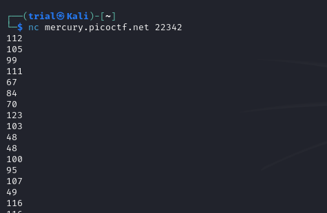
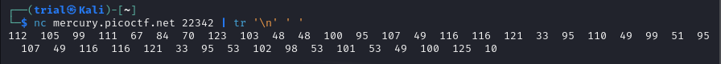
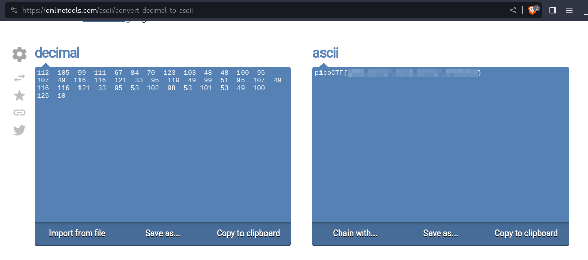

---
tags:
  - general-skills
points: 15 points
---
## Write-up
##### Concept Coverage :
This challenge is a basic introduction to connectivity tools. This one covers one the common network utility named [netcat](https://www.geeksforgeeks.org/introduction-to-netcat/).

##### Following are the steps for the challenge: 
1. Please ensure netcat is installed on your computer . if you are using webshell from picoCTF it has netcat installed. Below is the syntax to connect to open port on a machine.
   
```bash
nc <target-ip-or-fqdn> <target-port>
```

2. You are provided the connectivity command in the challenge description . once you run the command it connects you to the machine which returns a bunch of numbers and then closes the connection similar to snapshot below
   
    

3. upon trying a couple of times, we get same output. this is to check if we get random output. Since we don't get different output, we can assume the flag is within the numbers. I piped the netcat output to a [tr]() command to convert "\\n"(newline) to " "(space) so that we can view the output in a easier. 
   
   Note: the URL for netcat and output numbers might vary
   
   
```bash
nc <target-ip-or-fqdn> <target-port> | tr '\n' ' '
```

 4. Looks like ASCII characters are in their decimal values so I utilized online [converter tool](https://onlinetools.com/ascii/convert-decimal-to-ascii) but you can utilize any other online tool as well to convert the decimal to ASCII. Upon inputting the output we get the flag

    

5. If you are interest to learn more about ASCII you can use the following link : [w3school-ASCII](https://www.w3schools.com/charsets/ref_html_ascii.asp)
