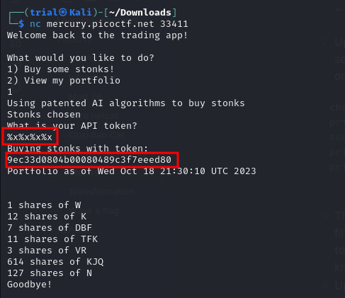
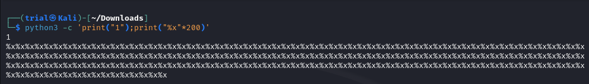
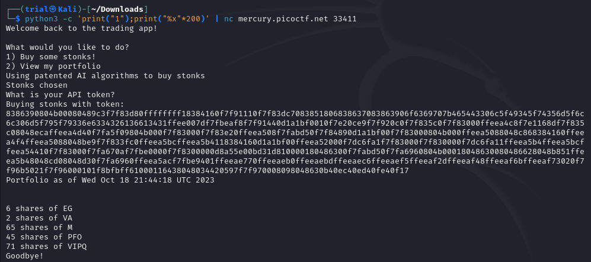
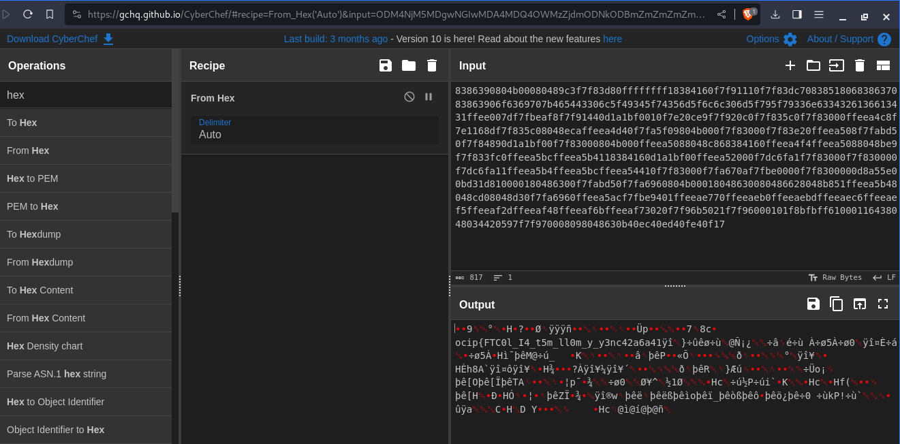
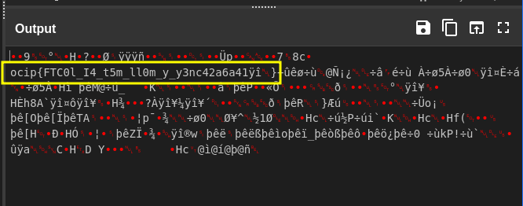
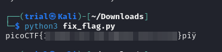
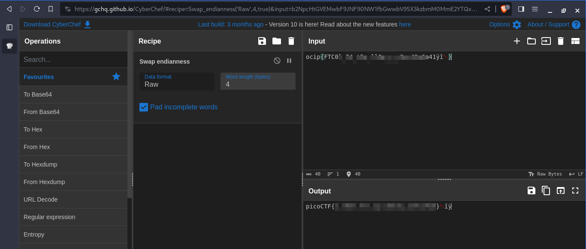

---
tags:
  - binary-exploitation
points: 20 points
---
## Write-up
##### Concept Coverage :
This challenge covers the concepts of a known vulnerability called [Format String vulnerability](https://owasp.org/www-community/attacks/Format_string_attack) located within printf and other variants in C.

##### Following are the steps for the challenge: 
1. We are provided with a netcat URL hosting a fake stock trading program. we are provided the code which is running on the server in a C file ("vuln.c" in my case but can change)

2. Upon opening the code and looking through it first thing we can take a look to find and see if we have a place to provide input . There is a chance that if there is no sanitization on printf we can exploit it. the below code stand out to me :
```C
char *user_buf = malloc(300 + 1);
printf("What is your API token?\n");
scanf("%300s", user_buf);
printf("Buying stonks with token:\n");
printf(user_buf);
```

3. The above mentioned code takes the input "user_buf" and it is displayed it out without filtering. we try provide a string input of a [format specifier](https://www.geeksforgeeks.org/format-specifiers-in-c/) . primary thought that came to my mind was buffer overflow but the input is of fixed size. next thing I looked up a for known issues with pointer and printf function and I found the [Format string vulnerabilty](https://owasp.org/www-community/attacks/Format_string_attack)
4. Upon giving a quick try I found that there is a value present in the stack of the allocated memory : 
   
	
   
5. so If we can provide enough string input we can make it printout a full stack upto a 100 Characters as input is restricted to width of 200 and %x is 2 character each. so I used a python command to generate the input for the script and piped it into netcat connection using the below mentioned command

```bash
python3 -c 'print("1");print("%x"*200)' | nc mercury.picoctf.net 33411
```

6. The above mentioned piece of python code (part before pipe) generates the below mentioned output
   
	
  
 7. we can pipe that output to the netcat command which will cause the output of the python code to act as input to the netcat and execute the code in an automated fashion. Upon doing that get following output : 
	 
 
8.  Now that we have the hex value output of the stack lets try to convert it into a readable string . I used online tool called [cyberchef](https://gchq.github.io/CyberChef/) for this but any hex to ASCII converter would same output.

	

  9. upon taking a closer look we can something similar to flag 
     
     

10. The Flag seems to have been have been reversed by 4 letters. example : "ocip <-> "pico". So  wrote a quick python code to fix (make sure you copy the string in multiple of 4 if you use below code):

```python
initial_flag = "<your-inverted-flag-here>"
fixed_flag = []
for i in range(0,len(initial_flag),4) :
	string_to_reverse = initial_flag[i:i+4]
	fixed_flag.append(string_to_reverse[::-1])
print(''.join(fixed_flag))
```

 11. Upon running the above script I got the flag. I also got some extra characters behind as after reversing the they we not part of the flag but got included because of the input
     
     

### Extra notes : 
After completing the challenge I was looking at other approach that we documented online and I learned that the flag being rotated in set of 4 character is because of how the data is stored and read . it was caused due data being in little endian . we can also use [cyberchef](https://gchq.github.io/CyberChef/) to switch the endians to big endians and it will make the flag readable

If you are interested , you can learn more about endians on [this page](https://www.geeksforgeeks.org/little-and-big-endian-mystery/).



