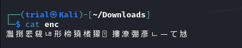

---
tags:
  - reverse-engineering
points: 20 points
---
## Write-up
##### Concept Coverage :
This challenge introduces us the concept of reverse engineering at a high level. This one is a code reversal to reverse the encoding and find the flag provided in the file.

##### Following are the steps for the challenge: 
1. Download the file with the encoded text (at time of writing file is called "enc" but it might change). Upon displaying the contents of the file looks like either Chinese/Japanese characters
   
   
   
2. We are also provided the below mentioned snippet of code in the challenge text. From the functions ([join](https://www.geeksforgeeks.org/python-string-join-method/),[chr](https://www.geeksforgeeks.org/chr-in-python/),[ord](https://www.geeksforgeeks.org/ord-function-python/)) and the [list comprehension](https://www.geeksforgeeks.org/python-list-comprehension/) seems like a python code. It also looks like it covers [bit shifting](https://www.interviewcake.com/concept/java/bit-shift)
   
``` python
''.join([chr((ord(flag[i]) << 8) + ord(flag[i + 1])) for i in range(0,len(flag),2)])
```

3. The given snippet can get difficult to understand in the provided format . Upon writing it in a readable format we get : 
   
```python
for i in range(0, len(flag), 2) : ## Loops through the string jumping 2 indexes

	first_character = (ord(flag[i]) << 8) ## gets its integer value for first character with ord() and it does left binary shift by 8 bits
	second_character = ord(flag[i + 1]) ## gets the integer value for second character from the set with ord()
	combined_character = chr(first_character + second_character) ## get the new encoded character with help of chr()
	encoded_message.append(combined_character) ## adds the newly geenrated encoded character to a list
	
print(''.join(encoded_message)) ## prints out the final string by combining all the generated string
``` 

4. The simple looking python code mentioned in the challenge is doing a decently complex algorithm. We also notice that since the program takes 2 characters from original string and encodes them in 1 the output string is half the length of the original string. 
   
5. Lets understand the encoding by taking an example : 
   
``` text
Example text = "pi"

Step 1 : "p" undergoes ord("p") << 8. 
Explaination : 
we do ord("p") which gives us integer value of p = 112 in decimal 
112 in binary is 1110000 and after "<< 8" operation we get 111000000000000 which is 28672 in decimal
so the value assigned to first_character variable is 28672

Step 2 : "i" undergoes ord("i").
Explaination : 
when we do ord("i") we get 105
so the value assigned to second_character variable is 105

Step 3 : chr(first_character + second_character)
Explaination : 
in next step we get chr(28672+105) = chr(28777) = "灩"

Similarly the whole original flag string is encoded in groups of two with result being one encoded character
``` 

6. Now lets try to understand the decode logic : 

```text 
Now when we try to decode

Example text = "灩"

Step 1 : lets try to get first character by reversing the left shift operator by doing ord("灩") >> 8
Explaination : 
1. when we do ord("灩") we get 28777 in decimal.
2. When we do ">> 8" on it, we go from binary value of '0111 0000 0110 1001' to '0111 0000' since when we do right shift the lost bits are dropped.
3. '0111 0000' in binary is 112 in decimal,if we do a chr(112) we get "p" which was our first character

Step 2 : lets try to get second character 
Explaination : 
1. now that we have the first character ("p") we can reverse the method from the encoding to get the second character. 
2. we can get the interger value for second character by subtracting (ord("p") << 8 ) from the ord("灩"): 
   we know from the from the encoding that
   ord("灩") = [ord("p") << 8] + ord(second_character)
   so ord (second_character) = ord("灩") - [ord("p") << 8]
   upon doing so we get ord(second_character) = 28777 - 28672 = 105

3. second character is chr(105) = "i"


now we just loop across the encoded string and combine the results to form a full flag

Note : This only works becasue the flag are usually combination of english characters, numbers and special characters. if any even place character (2nd,4th,6th etc.) whose Unicode value is higher than 255 is included in the original flag then reverse algorithm would not work  
```
   
7. Now that we understand our approach lets try to reverse it. The first character of original string can be obtained by right shifting the first character in the encoded string
   
```python 
first_decoded_character = chr(ord(encoded_flag[i]) >> 8)
decoded_string.append(first_decoded_character)

## shifting the binary value right will return us the orginal first character since when binary right shift happens,the moved bits are dropped.Refer to decoding explanation of Step 1 of decoding for details.
```

8. for the second character ,we need to subtract the integer value of first decoded character from the integer value of the encoded character and then convert the result to a character which will be second character.
   
```python

second_decoded_character = chr(ord(encoded_flag[i]) - (ord(first_decoded_character) << 8))
decoded_string.append(second_decoded_character)
## Subtracting the integer value of decoded character we get the second character. we are jsut reversing the operation. Refer to decoding explanation of Step 2 of decoding for details.
```

9. Now we just have to iterate through the loop of the function. Once we put the above code snippet into a loop and we run the function we get the flag.   
   
10. Full functional code can be found here : [decoding_function.py](assets/transformation/decoding_function.py) .

### Alternative method : 

1. After completing the challenge I was looking for write-up from other people who might have solved it for learning different technique others might have applied I found this post by another user xnomas on CTFtime : https://ctftime.org/writeup/26983 .  
   
``` note
Note: The same limitation as above mentioned method apply here . 
If any even placed character are higher than 255 in unicode value this will fail as well
```

```python
encoded_text = "text-from-the-file"
print(encoded_text.encode('utf-16-be'))
```
   