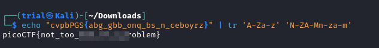

---
tags:
  - cryptography
points: 100 points
---

[<-- Cryptogrphy Write-ups](../writeup-list.md)

# 13
## Write-up

##### Concept Coverage :
This challenge is just a simple implementation of [ROT13](https://en.wikipedia.org/wiki/ROT13) Decryption

##### Following are the steps for the challenge: 
1. We are given a `ROT13` encrypted flag with the challenge. we just simply need to decrypt it to get the original flag. 

2. I used the following bash command to revert the `ROT13`

    ```bash
    echo "<challenge-string>" | tr 'A-Za-z' 'N-ZA-Mn-za-m'
    ```

    