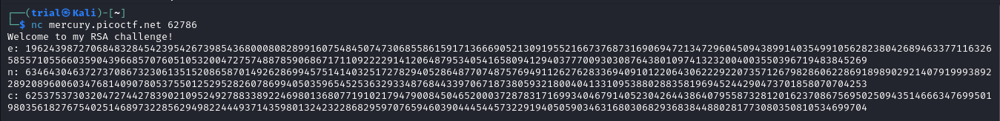
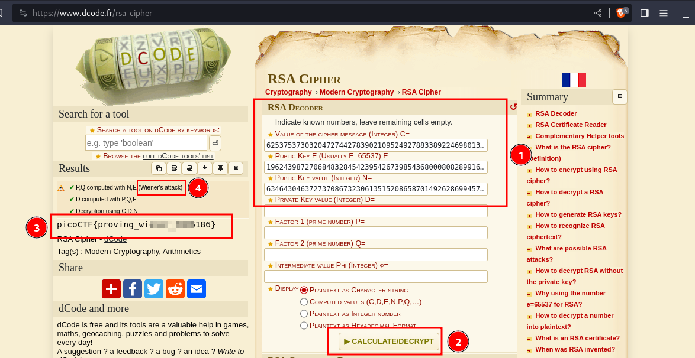

---
tags:
  - cryptography
points: 80 points
---

[<-- Cryptogrphy Write-ups](../writeup-list.md)

# Dachshund Attacks
## Write-up

##### Concept Coverage :
This challenge is introduction to a attack vector on [RSA](https://en.wikipedia.org/wiki/RSA_(cryptosystem)) called [Wiener's Attack](https://en.wikipedia.org/wiki/Wiener%27s_attack).

##### Following are the steps for the challenge: 
1. We are given a netcat conenction details to connect to. At the time of writing it was `nc mercury.picoctf.net 62786` but this might change in the future. Upon connecting it returns us an encrypted RSA and its componenets `c`,'`n` and`e`. There is a bit of a delay between us conencting and it giving us the RSA values.

    

2. Upon receiving the values I used an online tool called [dcode.fr](https://www.dcode.fr/rsa-cipher) to decode the RSA. I entered the value and upon running the RSA decoder I got the flag.

    

3. The way it deciphered was RSA was using something called wiener's Attack. I hadn't read about that before So I read up on the attack [More info on Wiener's Attack](https://en.wikipedia.org/wiki/Wiener%27s_attack). 
