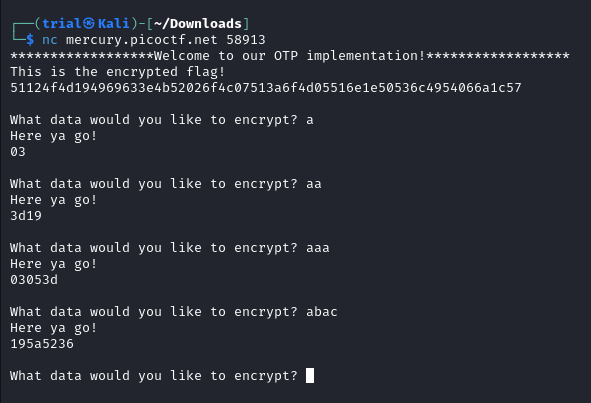
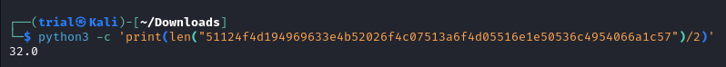
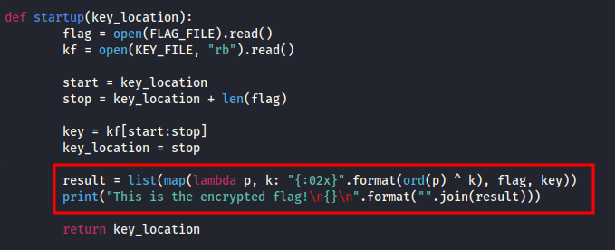
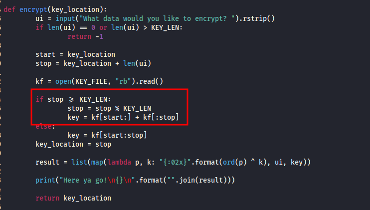
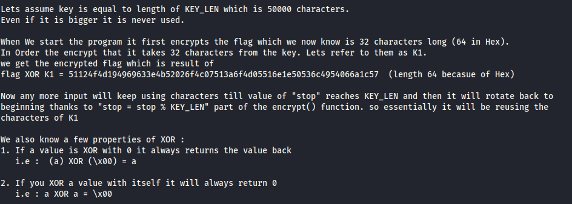
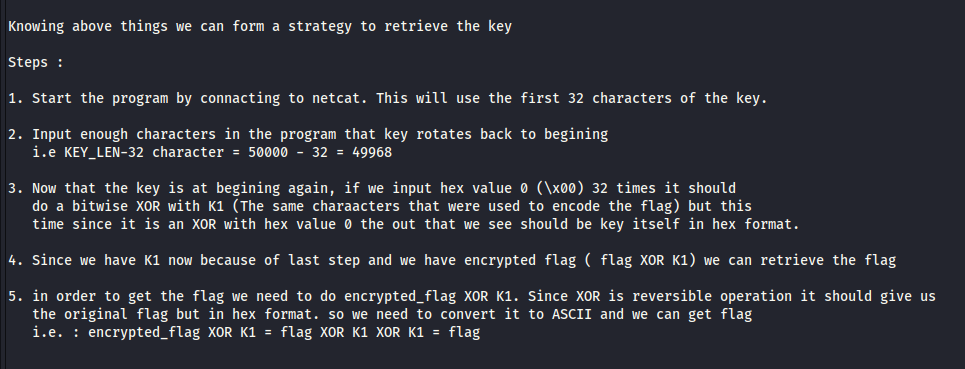
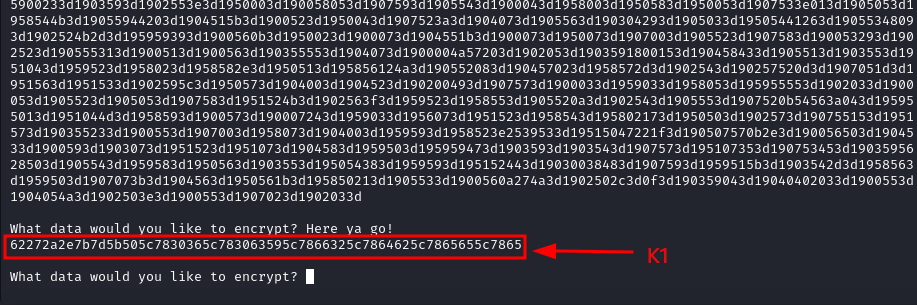
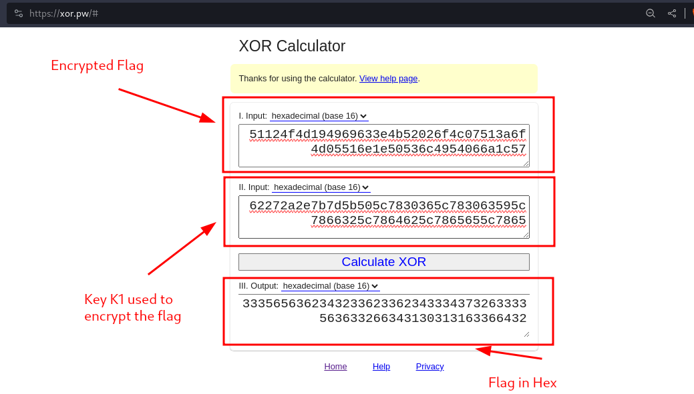
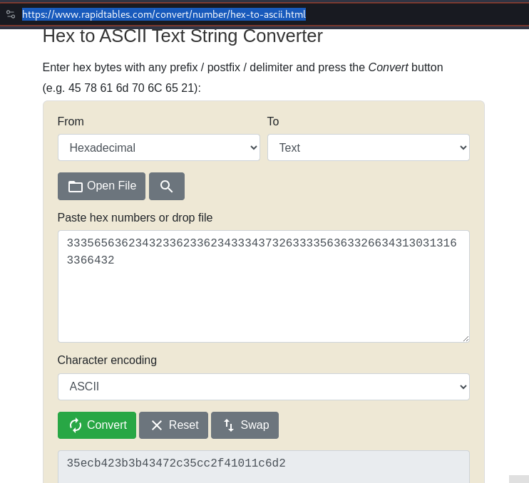

---
tags:
  - cryptography
points: 40 points
---

[<-- PicoCTF Category Table](../../README.md#2-picoctf)

# Easy Peasy

## Write-up
##### Concept Coverage :
This challenge is explores the concept of XOR and [One-Time Pad](https://en.wikipedia.org/wiki/One-time_pad)
##### Following are the steps for the challenge: 
1. We are given an [netcat](https://www.geeksforgeeks.org/netcat-basic-usage-and-overview/) connection details and a python script of a one time pad (OTP) cryptography which is running on the netcat server. 
   
2. Upon connecting to server we get the encrypted flag. I tried giving some input to it and noticed the output. I noticed that for 1 character of input the output I get is of 2 character.
    
    
    
3. Using the observation above we can deduce the flag's character length since we have the encrypted flag . 
    
    
    
4. Now lets take a look at the code. First thing we notice is a flag encryption that happens at the beginning of the code . it always take the start of the key to encrypt the flag so the output will same everytime we start the program. Furthermore we notice that it is doing an [bitwise XOR](https://www.loginradius.com/blog/engineering/how-does-bitwise-xor-work/) between input and key and prints the Hex output
    
    
    
5.  upon looking forward we notice that the function loops around encrypting everything in similar fashion using a bitwise XOR method. The interesting thing to notice here that key usage is capped at `KEY_LEN` and if the value of stop exceeds `KEY_LEN` then the key is reused from the beginning. Ideally you do not want the key to be repeated in one time pad. Also, the Key usage starts from where it was ended the previous time.
    
    
    
6. Upon reading though the code and keeping mind the above observation we come up with following interesting things
    
    
    
7. Using the above points, I came up with following strategy to get the flag : 
    
    
    
8. lets use the following command to put the plan into action (netcat details might change later):
   
```bash
python3 -c 'print("a"*49968);print("\x00"*32)' | nc mercury.picoctf.net 58913
```

9. Upon running we get the following output. we dont need the anything else except for last part: 
    
    
    
10. Now that I know the value of `encrypted_flag` and Key used to encrypt the flag using XOR `K1`  I can get the hex value of original flag using and online XOR calculator to compute XOR quickly. I used this online tool : [xor.pw](https://xor.pw/#)
    
    
    
11. Then I converted the hex value of the flag to original Text using an online convertor from [rapidtables](https://www.rapidtables.com/convert/number/hex-to-ascii.html) and I got the flag value. Note in this challenge we need to wrap the text-value we get with `picoCTF{}` . This is mentioned in the challenge. so flag to submit will be `picoCTF{<text-vaule>}`
    
    

