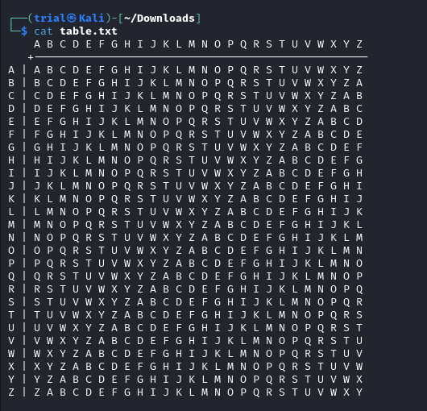
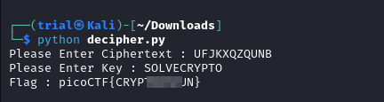

---
tags:
  - cryptography
points: 100 points
---

[<-- Cryptogrphy Write-ups](../writeup-list.md)

# Easy1
## Write-up

##### Concept Coverage :
This challenge is an introduction to One-time pad algorithm 

##### Following are the steps for the challenge: 
1. We are given a ciphertext `UFJKXQZQUNB` and Key `SOLVECRYPTO`. We are also given a table file to help us decipher it. The value above for ciphertext and key were at the time of writing but might change in the future.

    

2. One way to solve the challenge would be lookup and decipher using the table given to us but with some understanding of [one-time pad](https://en.wikipedia.org/wiki/One-time_pad) it is relatively simpler to write down a code to perform a simple decipher as one-time pad uses a modular addition since we already know the `key` used to cipher the text (Look at `Example` section in the [one-time pad](https://en.wikipedia.org/wiki/One-time_pad) for explaination)

3. Armed with the knowledge above I wrote a simple python code to give us the Flag. The challenge also suggests us to have flag value in full capital example `picoCTF{FLAG}`. We can submit the flag and complete the challenge.

    ```python
    cipher_text = input("Please Enter Ciphertext : ")

    key = input("Please Enter Key : ")  

    original_text = []

    for i in range(len(cipher_text)):
        original_text_number = ((ord(cipher_text[i]) - ord(key[i])) % 26) + 65  ## addin 65 to bring it to A-Z range
        original_text.append(chr(original_text_number))    ## adding the character to original text

    print("Flag : picoCTF{"+''.join(original_text)+"}")   ## Flag
    ```

    