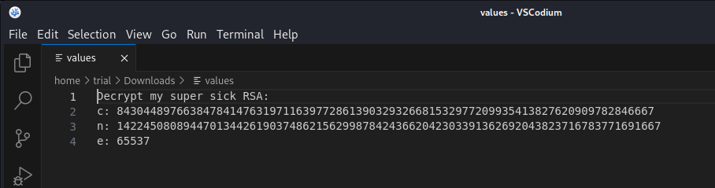
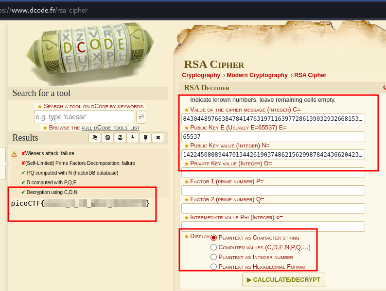
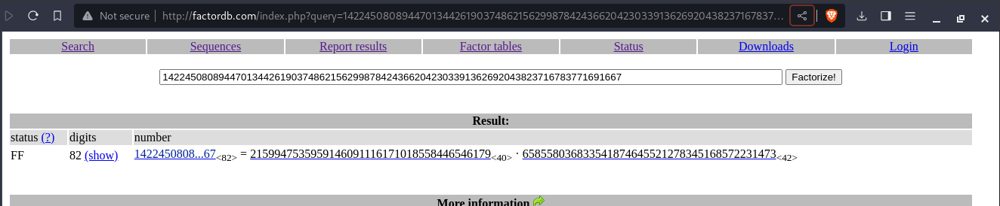

---
tags:
  - cryptography
points: 20 points
---

[<-- PicoCTF Category Table](../../README.md#2-picoctf)

# Mind your Ps and Qs

## Write-up
##### Concept Coverage :
This challenge is an introduction to asymmetric cryptography. It covers basic [RSA](https://www.techtarget.com/searchsecurity/definition/RSA) Algorithm . 

##### Following are the steps for the challenge: 
1. Download the file provided with the challenge . In my case the file is named "values" but can change in the future.
   
2. once you open the file you notice that it has a bunch of parameters given to us like n , c and e. Commonly in RSA : 
    1.  Public Key value modulus is usually referred as n
    2. Cipher Message is referred as c
    3. Public Key exponent is referred as e
    
    

3. Looking at the values provided I looked for an online RSA decoder and found this one : [decodr.fr](https://www.dcode.fr/rsa-cipher). I entered my value and c,n and e and it gave me the decoded flag 
    
    

4. If you are looking to do it manually you can try to factor the n using one of the online factorizer since it is a big number. you can use [factordb](http://factordb.com) for a quick result . With this you will be able to find the prime numbers used for this (p and q) . Now that you have p,q,n and e you can easily compute the decrypt exponent d and decrypt the message. Please refer back to [original RSA methodology](https://www.techtarget.com/searchsecurity/definition/RSA) to see decryption math
   
	
