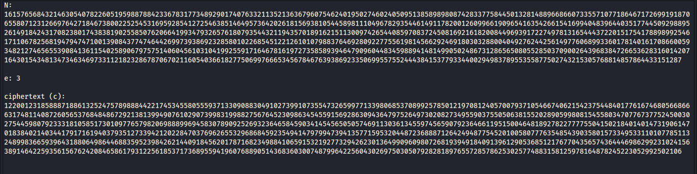
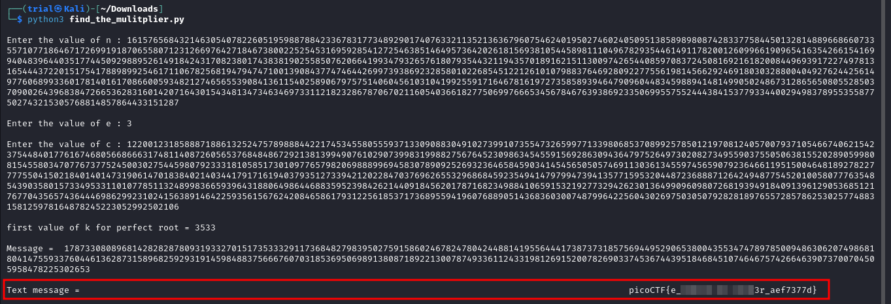

---
tags:
  - cryptography
points: 70 points
---

[<-- Cryptogrphy Write-ups](../writeup-list.md)

# Mini RSA
## Write-up

##### Concept Coverage :
This challenge explores the concept of the [RSA](https://www.comparitech.com/blog/information-security/rsa-encryption/).

##### Following are the steps for the challenge: 
1. We are provided with the cipher text file containing `c`,`n` and `e`. As the time of writing the values were as below image

    

2. As we know from the challenge description that it is a RSA. RSA usually uses the equation `c = m^e mod n` (The symbol `^` exponet i.e m to the power of e). `m` is message that we need and we have values of `c`,`n` and `e`. we cna convert the above equation to obtain the `m` i.e. `m = (kn + c)^(1/e)`

3. Since the numbers I big it gave me overflow error when I tried to use the basic python packages. So upon searching for better packages I came across a python package `gmpy2` ([More info](https://gmpy2.readthedocs.io/en/latest/intro.html)). It provides a nifty called `iroot` which returns a tuple of value of the `(root_number,boolean)` where `root_number` is the i<sup>th</sup> root and `boolean` is `true` if it is a perfect root and `false` otherwise. 

4. Based on the above I wrote the follwing python code. I initially decided to loop till `5000` as the challenge mentions `(m^e)` is barely larger than `n` and hence the value of `k` should be relatively small. in the end I had to convert the integer `m` back to hex and then convert the hex bytes to text: 

    ```python
    import gmpy2
    
    n = int(input("\nEnter the value of n : "))
    e = int(input("\nEnter the value of e : "))
    c = int(input("\nEnter the value of c : "))

    for k in range(5000):
        (message, perfect_root_boolean) = gmpy2.iroot(k*n + c, e)
        if perfect_root_boolean:
            print("\nfirst value of k for perfect root =",k)
            print("\nMessage = ",message)
            break
            
    print("\nText message =",bytearray.fromhex(format(message, 'x')).decode())
    ```

5. Upon running the above code we get the flag. We can submit anc complete the challenge

    
