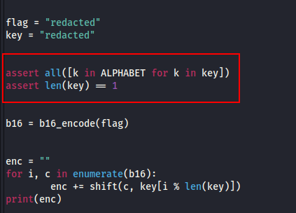
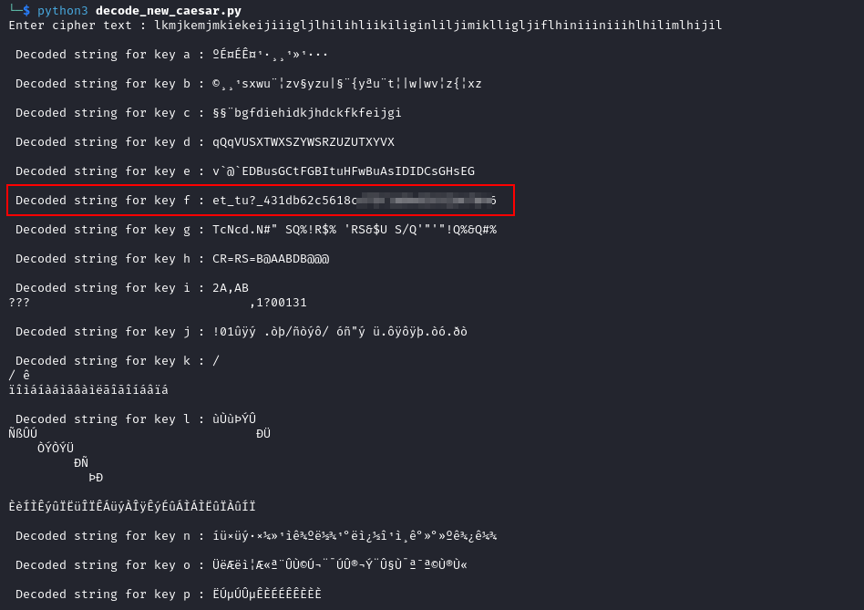

---
tags:
  - cryptography
points: 60 points
---

[<-- Cryptogrphy Write-ups](../writeup-list.md)

# New Caesar
## Write-up

##### Concept Coverage :
This challenge covers a bit of the reverse engineering as well as understand how the cipher is being generated and trying to create a decoding function for it

##### Following are the steps for the challenge: 
1. We are given a cipher and the code used to encrypt the cipher.
   
    - In my case the cipher was `lkmjkemjmkiekeijiiigljlhilihliikiliginliljimiklligljiflhiniiiniiihlhilimlhijil` and encryption file given is `new_ceaser.py` . This might change in future

2. Now lets take a look at the `new_ceaser.py` file. we notice a couple of function present in the file. lets first take a look at the from the beginning. In the main function we notice that we have a few `assert` statements.
   
    - First `assert` statement ensure that the elements in the key are present in `APLHABET` set.
      
    - Second `assert` statement ensure that key is only one character long.
      
    	

3. As a next step, it performs encoding which uses `b16_encode()` function to encrypt the original flag. Lets take a look at `b16_encode()` function
   
	- The `b16_encode` takes in a string (in our case `flag`) and then it generates the value of the character in `binary` format.
	  
	- Then it takes first four bits of the binary and and converts it to `integer` value. Since only four bits are used its value gets converted to be between `0-15` and then it converts it to character from the `ALPHABET` character set which is just `abcdefghijklmnop` and adds it to `enc` string that stores the encrypted string
	  
	- It performs the same step as above in the last four bits as well.
	  
	- So it essentially converts one input character to two encoded characters and both the encoded character are within `ALPHABET`  character set. 
	  
	- Once the `flag` string is encoded, the encoded string is returned to the main function and stored in `b16` string variable.
	  
		```python
		def b16_encode(plain):
		enc = ""
		for c in plain:
			binary = "{0:08b}".format(ord(c))
			enc += ALPHABET[int(binary[:4], 2)]
			enc += ALPHABET[int(binary[4:], 2)]
		return enc
		```
	
4. After the string is encoded the main function performs a custom `shift()` function on all the characters from the encoded string `b16`. Lets understand the `shift()` function.
   
    - First thing to notice is in the `for` loop used in the main function. when it calls the `shift()` function it passes two parameters `c`  which the encoded string character and `key[i % len(key)]` which is just meant to make the function look complicated because since we know `len(key)` is always `1` thanks to the second `assert` statement we discussed above. This causes the value of `i % len(key)` to always be `0` since anything with `% 1` will always result in `0`. so `key[i % len(key)]` can be boiled down to `key[0]` which will be key itself since it only one character
      
    - From the above we can that the value of `t2` in function `shift()` will always be difference of the integer value of character that being used as key and integer value of `a` because `LOWERCASE_OFFSET` is defined as `ord('a')` and `t2 = ord(key_cahracter) - ord('a')` .we also know that the key has to be character from `ALPHABET` set which is just `a to p`. so `t2` will be a value between `0` (for `key='a'` ) and `15` (for `key='p'`).
      
    - On the other hand `t1` will just be the `index` of the character in `ALPHABET` set as if `c = 'a '` then the `t1` will be `0` and `t1` can be maximum of `p` so for `c = 'p'` the value of `t1` will be `15` at maximum.
      
    - and then it returns the character and then the character is added as the final encoded text
		```python
		
		## function definatopm
		def shift(c, k):
		t1 = ord(c) - LOWERCASE_OFFSET
		t2 = ord(k) - LOWERCASE_OFFSET
		return ALPHABET[(t1 + t2) % len(ALPHABET)]
		
		## part from the main function
		enc = ""
		for i, c in enumerate(b16):
			enc += shift(c, key[i % len(key)])
		print(enc)
		```
	
5. Now that we understand the actual function lets try to reverse it . I wrote the outline of the function on how it would look like. Since we dont know what key was used to encode the flag we need to loop through all possible keys which is the set of characters from `a` to `p` as key has to be part of the `ALPHABET` set as per `assert` statement 1. Then for each key we would have to reverse the shift and then decode the `unshifted_cipher` to get the `flag` and from the flags that we get we can look for the one that might represent our original value so the main function I designed would look like this : 
    
		```python
		original_cipher_text = input("Enter cipher text : ")

		for key in ALPHABET:
		
			unshifted_cipher_text = reverse_shift(original_cipher_text,key)
			
			flag = b16_decode(unshifted_cipher_text)
			
			print("\n Decoded string for key",key,":",flag)
		```
	
6. Now lets dive into the `reverse_shift()` . we need to do the following things in order to reverse the shift
    - First  we know that the original character (the one before it got shifted) was in range of `0` and `15` and key is also in same range. based on that we have 2 conditions.
      
    - If the `value of index of key` is greater than `value of index of shifted char` then it means it is rotated by `% len(ALPHABET)` in the original `shift()` function. so in order to get the original value back we need to add the `value of len(ALPHABET)` to the `index of shifted char` and then subtract the `index of key` from it.
      
		```text
		Lets take an example to understand this
		
		During Encoding : 
		
		lets asuume the following : 
		charcter getting shift is 'f' and key being used is 'o'
		
		so as per shift() :
		t1 = ord(f) - ord(a) = 102 - 97 = 5 
		t2 = ord(o) - ord(a) = 111 - 97 = 14
		
		t1 + t2 = 19
		
		(t1 + t2) % len(ALPHABET) = 19 % 16 = 3
		and the char returned will be ALPHABET[3] = 'd' (index starts from 0 so index of 3 is 4th char)
		
		-----------------------------------------------------------------------------------------------------
		
		During Decoding : 
		
		lets asuume the following : 
		charcter we are revesing is 'd' and key being used is 'o' 
		
		then we can obtain 'f' again if we get the value of 5 
		
		3 = (5 + 14) % 16 from the encoding process we can reverse it doing the following
		
		3 + 16 = 5 +14
		3 + 16 - 14 = 5
		index('d') + len(ALPHABET) - index('o') = index('f')

		```
	
	- If the `value of index of key` is less than `value of index of shifted char` then get the original value by directly subtracting the `index of key` from the `index of shifted char`
	  
		```text
		Lets take an example to understand this
		
		During Encoding : 
		lets asuume the following : 
		charcter getting shift is 'f' and key being used is 'b'
		
		so as per shift() :
		t1 = ord(f) - ord(a) = 102 - 97 = 5 
		t2 = ord(b) - ord(a) = 98 - 97 = 1
		
		t1 + t2 = 6
		
		(t1 + t2) % len(ALPHABET) = 6 % 16 = 6 = t1 + t2
		and the char returned will be ALPHABET[6] = 'g' (index starts from 0 so index of 6 is 7th char=g)
		
		--------------------------------------------------------------------------------------------------------
		
		During Decoding : 
		lets asuume the following : 
		charcter we are revesing is 'g' and key being used is 'b' 
		
		then we can obtain 'f' again if we get the value of 5 
		6 = (5 + 1) % 16 = (5 + 1)
		6 - 1 = 5
		index('g') - index('b') = index('f')
		```
	
	- So based on above logic I wrote down the `reverse_shift()` function as follows : 
		```python
		def reverse_shift(original_cipher_text,shift_key):
		
			unshifted_cipher_text = ""	
			for orignal_chipher_char in original_cipher_text:
			
				shifted_char_index = ALPHABET.index(orignal_chipher_char)
				shift_key_index = ALPHABET.index(shift_key)
				
				if(shifted_char_index < shift_key_index):
					unshifted_char_index = shifted_char_index + len(ALPHABET) - shift_key_index 
				else:
					unshifted_char_index = shifted_char_index - shift_key_index	
					
				unshifted_cipher_text += ALPHABET[unshifted_char_index]
				
			return unshifted_cipher_text
		```
	
7. Now its the time to reverse the `b16_encode()` function. This is relatively simpler. I used the following logic develop the code. 
    - we know that the original encode took the 8-bit binary value of one character and split it into two characters by using the value of first four bits as index for first character and last four bits for the second. 
      
    - So for decoding we take pair of two character and get the index value for both the characters. 
      
    - Then shift the index value of first character to left by four bits and then add the 4 bits value of second one in the end. 
      
    - Now the we have the decimal value of the original character we can convert it to character and once we loop through the whole string we will get the original flag
      
    - so based on the logic above I designed the `b16_decode()` function as below :
      
		```python
		def b16_decode(encoded_string):
			decoded_string = ""
			for i in range(0,len(encoded_string),2):
				
				first_character = encoded_string[i]
				second_character = encoded_string[i+1]
			
				first_half_original = ALPHABET.index(first_character) << 4
				second_half_original = ALPHABET.index(second_character)
				
				full_original = first_half_original + second_half_original
				original_character = chr(full_original)
				
				decoded_string += original_character	
					
			return decoded_string
		```
	
8. Now that we have all the part ready we can run the script and we will get the flag for each key 
    ```bash
    python3 <decode-python-file>
	```
	
9. I got the following output of possible flag values. The is one which starts from `et_tu` which is the flag. It is a reference back to Julius Ceaser's words `et tu, brute?` ([More info](https://en.wikipedia.org/wiki/Et_tu,_Brute%3F)) . I have blurred out the flag in the output-image but it is clear in the out and we need to warp it within `picoCTF{}` as the challenge suggests and the submit the flag to complete the challenge.
    
    
    
10. You can also find the full decipher function here : [decode_new_caesar.py](./assets/decode_new_caesar.py)

