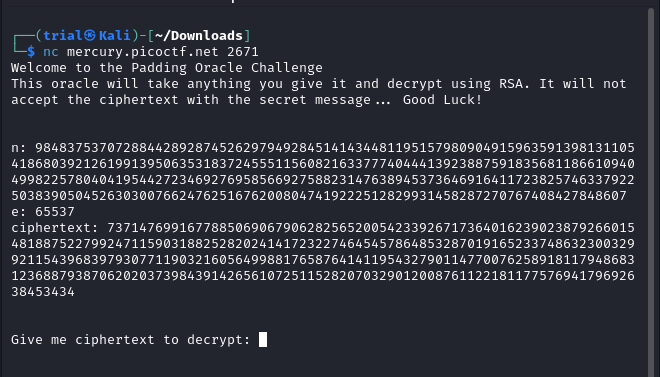
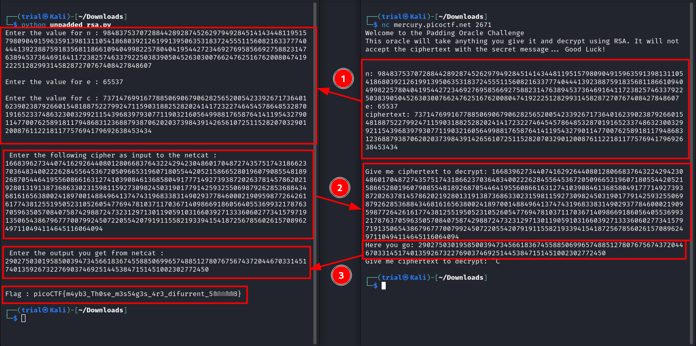

---
tags:
  - cryptography
points: 90 points
---

[<-- Cryptogrphy Write-ups](../writeup-list.md)

# No Padding, No Problem
## Write-up

##### Concept Coverage :
This challenge is introduction to a few properties of unpadded RSA (As title suggests "No Padding")

##### Following are the steps for the challenge: 
1. Along with the challenge description we are given a netcat connection details. At the time of writing it was `nc mercury.picoctf.net 2671` but this might change in the future

2. Upon connecting, we get a RSA cipher with `n`, `e` and `c`. it aslo says that it will decrypt any cipher text with the given `n` and `e` except for the encrypted message `c` (image below).

    

3. From the challenge name we get that the RSA used might be unpadded RSA (also known as textbook RSA). Unpadded RSA are [homomorphic](https://dualitytech.com/blog/what-is-homomorphic-encryption/) which means the `encryption(message * number) = encryption(message) * encryption(number)`. we can leverage this property to help us decrypt the message. 

4. For the sake of simplicity I decided to take the number as `10`. based on that i wrote the below python script. 

    ```python
    n = int(input("Enter the value for n : "))
    e = int(input("\nEnter the value for e : "))
    c  = int(input("\nEnter the value for c : "))

    known_number = 10
    known_RSA_cipher = pow(known_number,e,n)

    input_cipher = c * known_RSA_cipher
    print("\n\nEnter the following cipher as input to the netcat : ")
    print(input_cipher)

    output_message = int(input("\n\nEnter the output you get from netcat : \n"))
    original_message = output_message//known_number

    print("\n\nFlag :",bytearray.fromhex(format(original_message, 'x')).decode())
    ```

    ```text
    Note : Each time you open a netcat connect the value of n,e and c changes so It is required to have 2 terminal open at same time -- one running the script and other one the netcat conenction so that you dont have to reset the connection as you will have to copy and paste values between the terminals without resetting the netcat connection.
    ```

5. The script is simple to understand it takes the advantage of the `homomorphic` property of the unpadded RSA. we encode a known number `10` using the `n` and `e` used for encrypting the message. then we mulltiply the encrypted `10` with `c` (encrypted flag) i.e. `encryption(message) * encryption(number)` which is equal to `encryption(message * number)` due to `homomorphic` property. now we can used the `encryption(message * number)` value in the netcat and it will give use the unencrypted text which in this case will be `message * number` and since we know that number is `10` we can get the `message` by dividing. Once we have `message` we just need to convert bytes back to sting to get the flag in `string` format.

6. Upon running the script I got the flag. we can submit the flag anc complete the challenge

    