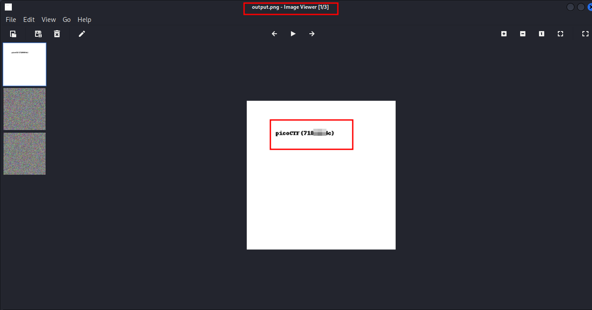

---
tags:
  - cryptography
points: 100 points
---

[<-- Cryptogrphy Write-ups](../writeup-list.md)

# Pixelated
## Write-up

##### Concept Coverage :
This challenge is introduction to the concept of the [Visual Cryptography](https://en.wikipedia.org/wiki/Visual_cryptography).

##### Following are the steps for the challenge: 
1. We are give 2 images as a part of the challenge. As the time of writing they are called `scrambled1.png` and `scrambled2.png` but this might change.

2. Upon opening the images we notice that both images are pixelated. 

    - Image 1 : scarmbled1.png

    

    - Image 2 : scarmbled2.png

    

3. Seeing as we have 2 pixelated images it led me to believe that it is a `Visual Cryptography` in which we can add both the images to get a new image with the details. So In order to achieve that I used the following python code with the library called `pillow` and `numpy`.

    ```python
    import numpy as np
    from PIL import Image

    image_file1 = Image.open("scrambled1.png")
    Image_file2 = Image.open("scrambled2.png")

    image_data1 = np.array(image_file1)
    image_data2 = np.array(Image_file2)

    result = image_data1 + image_data2

    Image.fromarray(result).save('output.png')
    print("Images combination complete")
    ```

4. The code written above takes the image and opens it as an `numpy array` and they we add both images and then save the resulting `numpy array` back as an image. Remeber to save the code file in the same location you your images or update the path in `Image.open()` function to point it to your images.

    

5. Upon opening the file we notice the flag in the new image. I have blurred out the flag in the image but in the actual image it is very clear. we can submit this flag and it will complete the challenge.

    