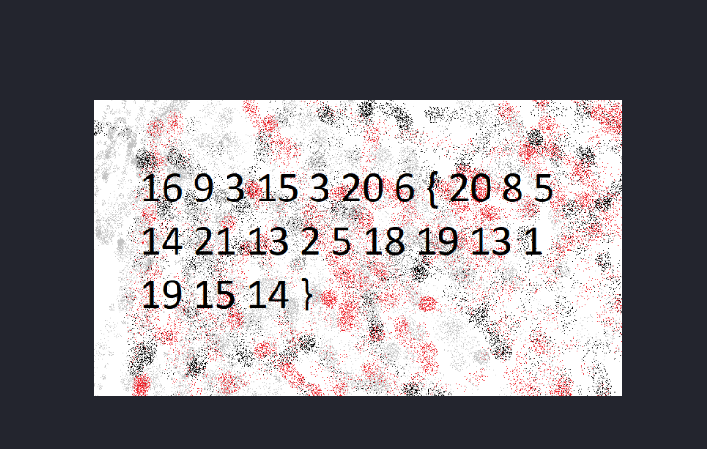
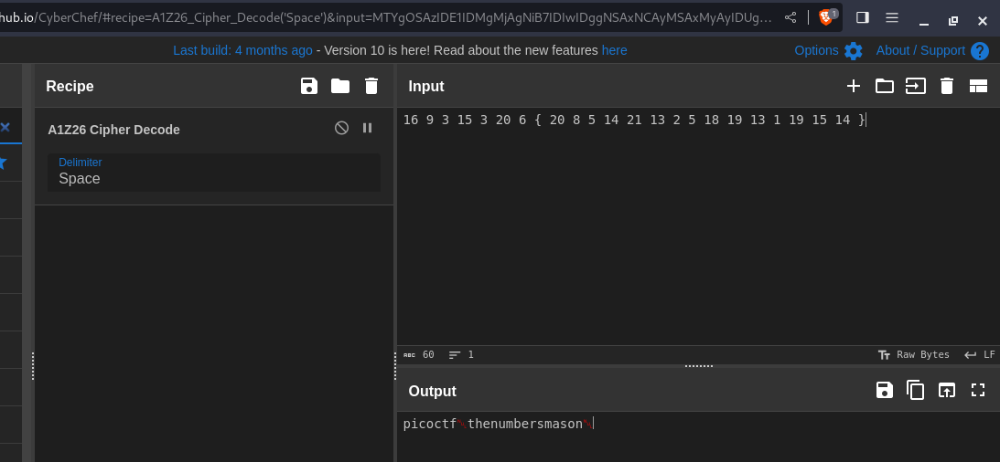
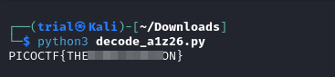

---
tags:
  - cryptography
points: 50 points
---

[<-- Cryptography Write-ups](../writeup-list.md)

# The Numbers

## Write-up
##### Concept Coverage :
This challenge is an introduction to `A1Z26` cipher . It is a basic substitution cipher in which `A=1, B=2 ... Z=26`.

##### Following are the steps for the challenge: 
1. We are given an image with the challenge.
   
2. Once we open the image we see a bunch on numbers in the image . The image in my case was as below
    
    
    
3. I copied the numbers from the image into a text file for easier. I noticed that first few characters are `16=P, 9-I` and so on. so seems like we are directly given a flag just in A1Z26 encrypted form. I used [cyberchef](https://gchq.github.io/CyberChef/#recipe=A1Z26_Cipher_Decode('Space')) to quickly decipher it. (replace the weird characters with `{ and }` . Since they are not part of the `A-Z` they get decrypted weirdly.
    
    
    
4. You can also use the below python if you are interested to decode it manually : 
    
    
   
    ```python
    decode_helper_string = "ABCDEFGHIJKLMNOPQRSTUVWXYZ"

    encoded_text = [16,9,3,15,3,20,6,"{",20,8,5,14,21,13,2,5,18,19,13,1,19,15,14,"}"]  ## numbers from the image 

    decoded_string = ""

    for i in encoded_text :
        if isinstance(i, int) :   ## checks if i is an integer
            decoded_string = decoded_string + decode_helper_string[i-1] ## if i is interger append the corresponding character to string
        else :
            decoded_string = decoded_string + i ## if it is not an integer then append as it is mainly for { and }

    print(decoded_string)
    ```
