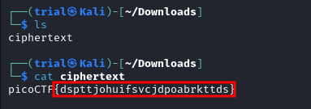
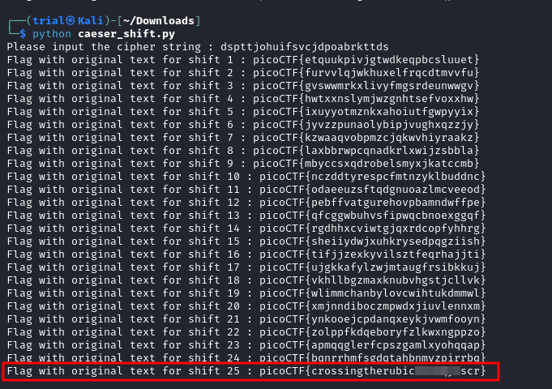

---
tags:
  - cryptography
points: 100 points
---

[<-- Cryptogrphy Write-ups](../writeup-list.md)

# caesar
## Write-up

##### Concept Coverage :
This challenge covers basic [caesar cipher](https://en.wikipedia.org/wiki/Caesar_cipher) principles

##### Following are the steps for the challenge: 
1. We are given a file with the challenge to decipher. we have a file with the flag but the flag string seems to have ciphered.

    

2. Since from the challenge name we know that is a `caesar cipher`, I wrote the following python script to give the string for each consecutive shift as we dont know what the shift value is.

    ```python
    ALPHABET = "abcdefghijklmnopqrstuvwxyz"

    cipher_text = input("Please input the cipher string : ")

    for i in range(1,26):

      original_text = ""
      for t in cipher_text :
          orginal_string_index = (ALPHABET.index(t) + i) % 26             
          original_text = original_text + ALPHABET[orginal_string_index]

      print("Flag with original text for shift",i,": picoCTF{"+original_text+"}")
    ```

3. Upon running the above code I got the output as below. Out of all the string with the shift of `25` reads as `Crossing the Rubicon` which is an idiom that means `passing a point of no return` by Caeser. We can submit the flag and complete the challenge.

    

