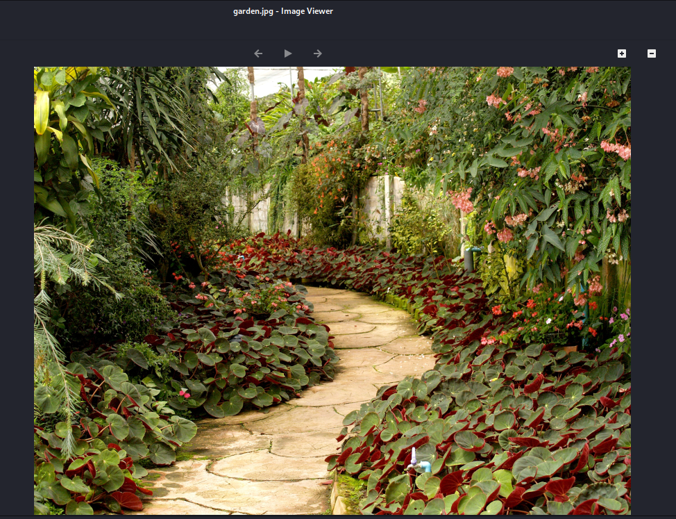
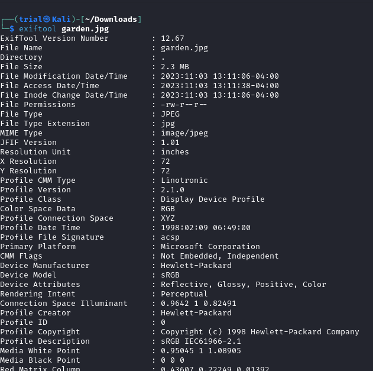
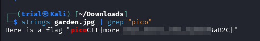

---
tags:
  - forensics
points: 50 points
---

[<-- Forensics Write-ups](../writeup-list.md)

# Glory of the Garden

## Write-up
##### Concept Coverage :
This covers using hex-editor to read the text added to the file
##### Following are the steps for the challenge: 
1. Download the image file from the challenge. In my case, at the time of writing the file is called `garden.jpg` (subject to change)
   
2. Upon opening file and inspecting, nothing seems to standout in terms of flag.
    
    
   
3. As a next step we try to explore the metadata for potential clues. For this you can utilize a linux utility called [exiftool](https://en.wikipedia.org/wiki/ExifTool) or you can use online metadata extractors like [this one](https://exif.tools/) . Nothing seems to stand out in particular
    
    
   
    ```bash
    exiftool <image-file-name>
    ```
  
4. As a next step, I tried to check if there were any strings present in the file. i used the `strings` command and piped it to `grep` command to find the flag and the out had the flag in it. so it would mean that the flag was added to file as it was an image file. I am guessing since `strings` gave out the flag we could have also found the flag by opening it in hexeditor and reading through the file 
    
    
   
    ```bash
    strings <image-file> | grep "pico"
    ```

  