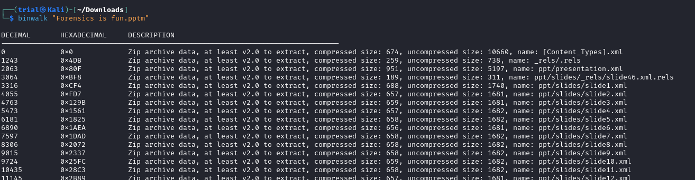
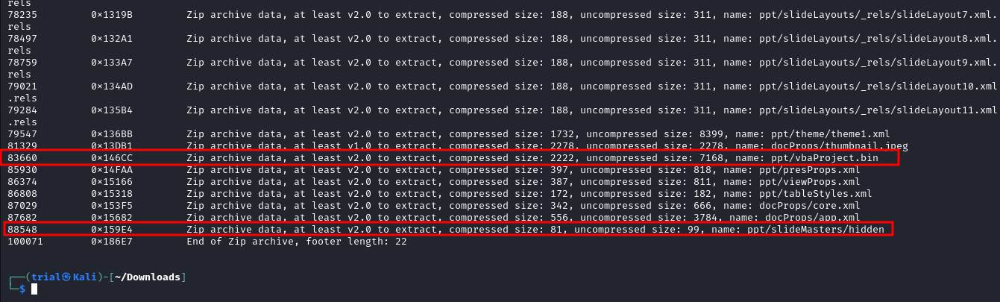
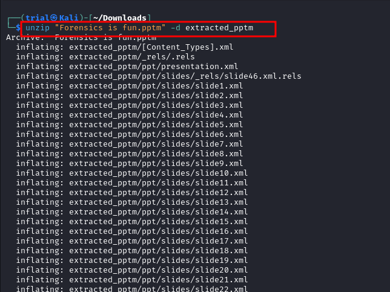
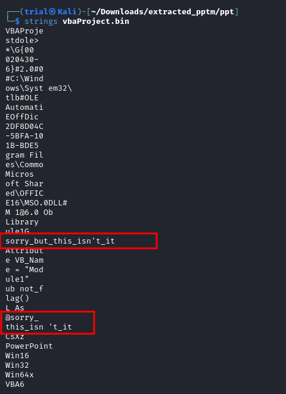
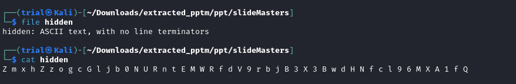
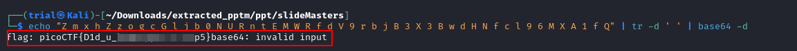
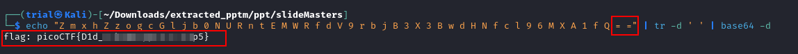
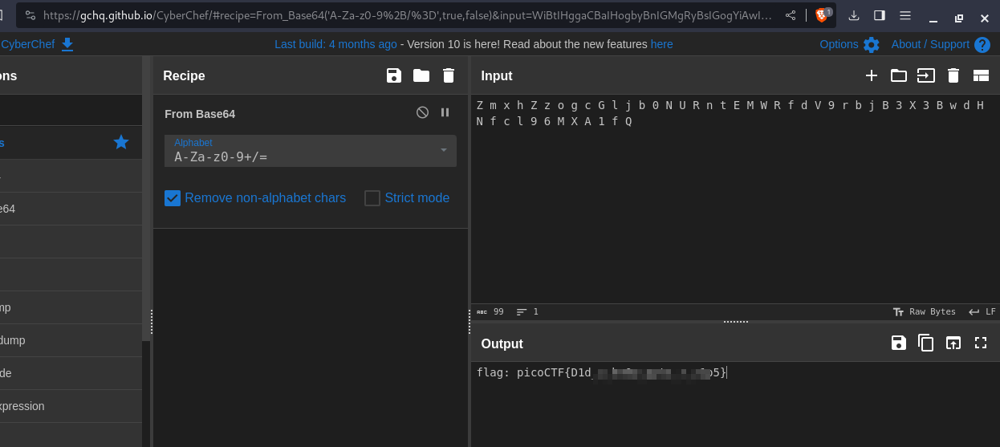

---
tags:
  - forensics
points: 60 points
---

[<-- Forensics Write-ups](../writeup-list.md)

# MacroHard WeakEdge
## Write-up

##### Concept Coverage :
This challenge covers a lesser know concept of the `Powerpoint Presentations` that they are actually a special kind of `zip` .

##### Following are the steps for the challenge: 
1. We are given a `Powerpoint Presentaion` file as a part of challenge. In my case it was called `Forensics is fun.pptm` but this might change.
   
2. Upon looking through the presentation, I did not find anything that drew my attention. but if you notice the extension is `.pptm` and not `.ppt` or `.pptx`. `.pptm` represents that it might potentially contain Macro which can run when it is opened. Also `Powerpoint` files are in a way zip files so I can extract of Macro if I unzip the files. lets first take a look at what might be bundled up . we can use `binwalk` for that.
    
    ```bash
    binwalk <pptm-file>
	```
    
    
    
3. From `binwalk` output I found a couple of interesting files. First one was a `vbaProject.bin` file which a VBA Macro file and other was a file named `slideMasters/hidden`  which is not a usual file in a `.pptm` bundle.
    
    
    
4. Lets take a look those files for that we need to extract `.pptm` . we can use `unzip` utility for that.
    
    ```bash
    unzip <pptm-file> -d extracted_pptm
	```
	
	
	
5. now that we have it extracted lets take a look those files. I started with `vbaProject.bin` since that was the VBA macro file. I used `strings` to see if it had anything related to flag in it but it was the file with flag
    
    ```bash
    strings <vba-file-path>
	```
    
    
    
6. Then I moved on to the other file named `hidden` . it was just a text file to printed out the contents of the file using `cat` and it gave me a bunch of characters. It looks like a `base64` encoded text.
    
    
    
7. I used the below command to convert the `base64` text back to original text and we get the flag
    
    ```bash
    echo "<text-from-hidden-file" | tr -d ' ' | base64 -d
	```
    
    
    
    It has the `invalid input error` message as usually `base64` will end with `==` in the end that can be fixed if we add `= =` to the text we get from the `hidden` file.
    
    
    
    Alternatively, you can also use and online tool like [CyberChef](https://gchq.github.io/CyberChef/#recipe=From_Base64('A-Za-z0-9%2B/%3D',true,false)) to decode `base64` as well. Those are usually good in handling the offset like `==` in the above case 
    
    
    
8. We can go ahead and submit the flag to complete the challenge.

