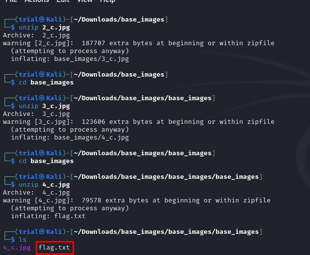

---
tags:
  - forensics
points: 30 points
---
#  Matryoshka doll

## Write-up
##### Concept Coverage :
This challenge explores the concept of embedded files and few methods to identify them
##### Following are the steps for the challenge: 
1. Download the file provided with the challenge. In my case it was `dolls.jpg`.
2. First thing we try to open the Image and try to see if we get anything to work with.
3. I didn't find anything out of the ordinary with the image so as a next step I tried to look at the metadata. I used `exiftool` for it. In the metadata I found a warning saying there might be extra bytes in the files. I limited the output in the image below to represent relevant data in single screenshot using `tail` .
    
    
    
4. Now that we know that there might be addition bytes lets try to use `binwalk` to determine the type of data. we notice that there is a zip file present in the image. 
    
    
    
5. Since it is a zip archive we can use `unzip` to extract the archive. Upon unzipping we get a folder called `basee_images`. it contains another image named `2_c.jpg`
    
    
    
6. The new image `2_c.jpg` is similar to initial `dolls.jpg` image . This is the concept of original [Matryoshka dolls](https://en.wikipedia.org/wiki/Matryoshka_doll) which is dolls containing smaller doll within due to which they are also called "Nesting dolls". so if we try to keep unzipping we get all the way to `4_c.jpg`. and upon unzipping `4_c.jpg` we find a `falg.txt` file
    
    
    
7. We can print the content of `flag.txt` to get the flag. 
    
    
    
   
