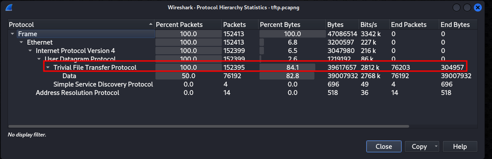
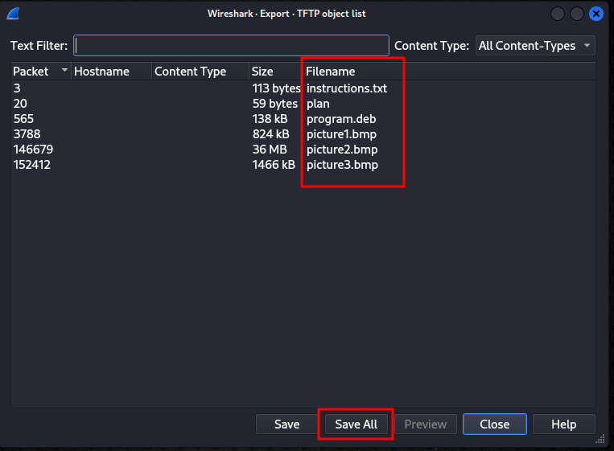
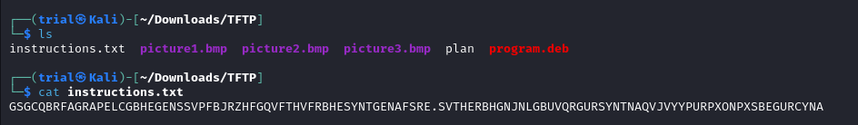
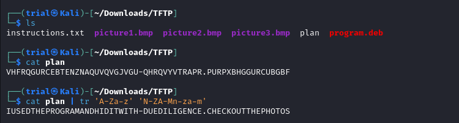
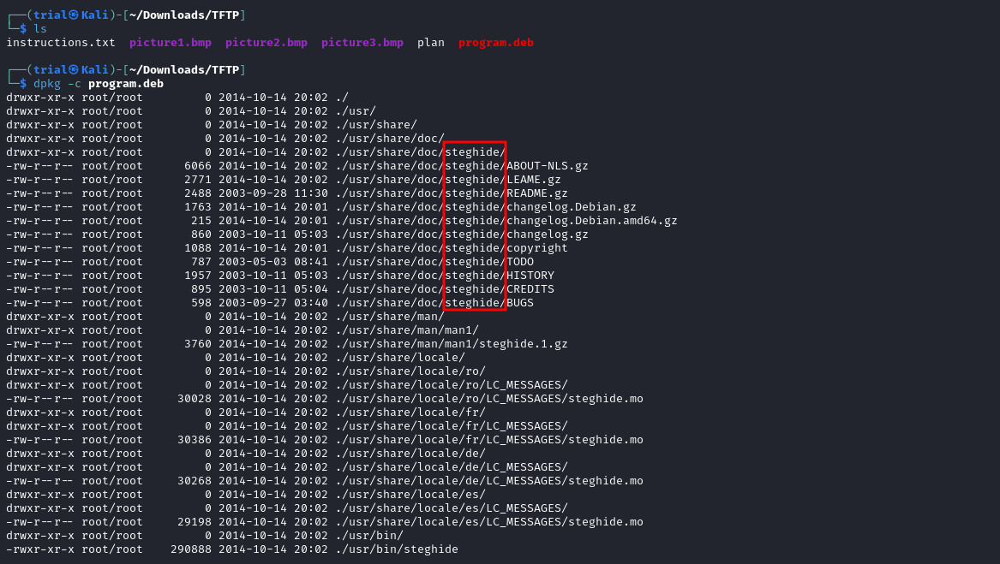
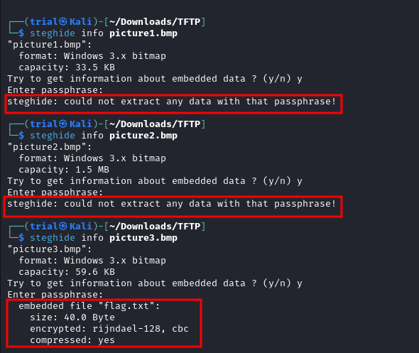
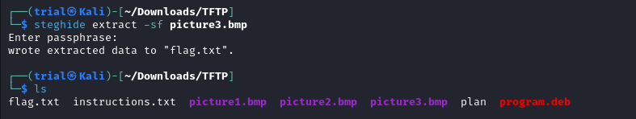
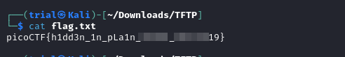

---
tags:
  - forensics
points: 90 points
---

[<-- Forensics Write-ups](../writeup-list.md)

# Trivial Flag Transfer Protocol
## Write-up

##### Concept Coverage :
This challenge is introduction to an older version of FTP (File Transfer Protocol) called [TFTP](https://en.wikipedia.org/wiki/Trivial_File_Transfer_Protocol) (Trivial File Transfer Protocol)

##### Following are the steps for the challenge: 
1. we are given a Wireshark file capture file in the challenge. In my case it was called `tftp.pcapng`.

2. Upon opening the file in wireshark and navigating to `Statistics --> Protocol Hierarchy` (see image below) we notice that indeed the wireshark capture mainly contains TFTP packets. 

    

3. As TFTP transfers the data unencrypted, we can export the files that were shared in TFTP packet capture by navigating to `File --> Export Objects --> TFTP` . You will see a dialog box similar to the one below. It will also let you save the file somewhere on your computer. I went ahead saved it on a folder named `TFTP` in my `Downloads`.

    

4. I opened a terminal and navigated to the folder in which I saved my files. The first file that I noticed was `instructions.txt`. Upon reading the contents of the file we get the following : 

    

5. That seems to be a message encrypted with ROT13. So I used the below script to reverse the encryption and got the following : 

    ```bash
    cat instructions.txt | tr 'A-Za-z' 'N-ZA-Mn-za-m'
    ```

    


6. At first I thought the message was weird but upon taking a closer look it was reading as `TFTP DOESNT ENCRYPT OUR TRAFFIC SO WE MUST DISGUISE OUR FLAG TRANSFER. FIGURE OUT A WAY TO HIDE THE FLAG AND I WILL CHECK BACK FOR THE PLAN`. So now lets take a look at the `plan` file. Upon reading the contents of the `plan` file it seems to have the same ROT13 encoding. Upon decoding (command below) I got the following text (see image) : 

    ```bash
    cat plan | tr 'A-Za-z' 'N-ZA-Mn-za-m'
    ```
    
    

7. The message from the Plan reads as `I USED THE PROGRAM AND HID IT WITH - DUEDILIGENCE .CHECK OUT THE PHOTOS`. It suggests that some data is hiding withing the photos and it was hid using some program. we also see that we have a debian package called `program.deb`.

8. I used `dpkg` to see what sort of files are present in `program.deb`. It turns out it is just a debian package for tool named `steghide` which is used to embed one file into another. This is called Stegnography.

    

9. The other thing the stood out is in the message that we got from the `plan` file it says the program hid the data using `DUEDILIGENCE`. it stood out to me as it was seperated from normal string using a `-`.

10. `steghide` uses a passphrase when hiding a file so I guessed `DUEDILIGENCE` was the passphrase used for hiding. we can use to see if any file was hidden in images using `steghide info` on each file. It will ask for a Passphrase which will be `DUEDILIGENCE`. I found that `picture3.bmp` had a flag.txt hidden in it.

    ```bash
    steghide info <filename>
    ```

    

11. We can extract it using `steghide extract` command with `-sf` flags. `-sf` flag are used to provide `stegofile` which is just the fancy way of saying file with embedded data. Once you run the command it will ask for passphrase which will be again `DUEDILIGENCE`.

    ```bash
    steghide extract -sf <file-name>
    ```

    

12. Upon reading the extracted `flag.txt` file we get the flag. We can submit the flag and complete the challenge.

    
  