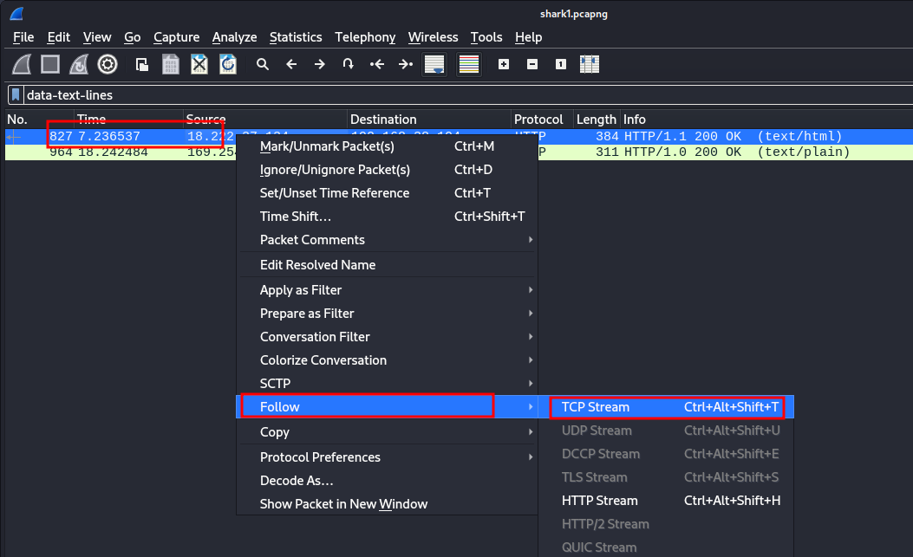

---
tags:
  - forensics
points: 50 points
---

[<-- Forensics Write-ups](../writeup-list.md)

# Wireshark doo dooo do doo

## Write-up
##### Concept Coverage :
This challenge covers concepts of wireshark and tcp streams 

##### Following are the steps for the challenge: 
1. We are provided with a `.pcapng` file which is a packet capture file. At the time of solving the file is called `shark1.pcapng` but this may change in the future.
   
2. I am leveraging Wireshark for this to make it easier but you can achieve similar results using `tshark` which is terminal application if you want.
3. Upon opening the file in Wireshark we notice a lot of packets. So in order to get a high level understand of packets that might be present we can take a look at the protocol hierarchy. In order to open that we need to open `Statistics --> Protocol Hierarchy` : 
    
    
    
4. We notice that we have a few packets with `Line-based text data` . Upon selecting that as a filter we get 2 packets : 
    
    
    
    
    
5. lets take the first one and follow the TCP stream for that. we can right-click on the packet and do `Follow --> TCP Stream` (Shown in image below) : 
    
    
    
6. when the stream opens we can see that we have text that looks like a flag. Seems to be `ROT13` encoded. 
    
    
    
7. lets take that value and do a `ROT13` decode using the following command in terminal : 
   
    ```bash
    echo "<input-string>" | tr 'A-Za-z' 'N-ZA-Mn-za-m'
    ```

8. Upon running the above command we get the flag : 
    
    