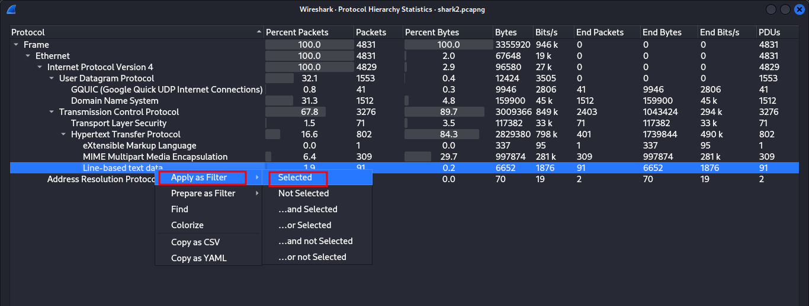
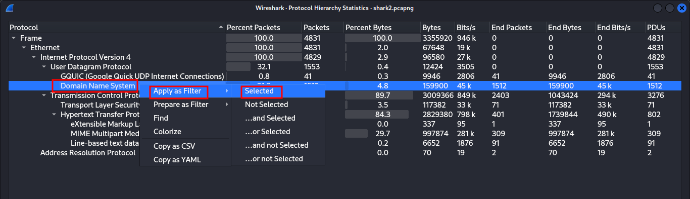
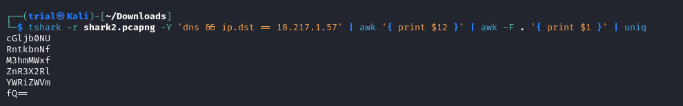

---
tags:
  - forensics
points: 100 points
---

[<-- Forensics Write-ups](../writeup-list.md)

# Wireshark twoo twooo two twoo
## Write-up

##### Concept Coverage :
This challenge covers the concept of the [DNS exfiltration](https://www.infoblox.com/dns-security-resource-center/dns-security-issues-threats/dns-security-threats-data-exfiltration/)  

##### Following are the steps for the challenge: 
1. We are given a wireshark capture file with the challenge. At the time of writing it was called `shark2.pcapng` but this might change. 

2. Upon opening the file in wireshark, First thing I like to do is get the understanding of the capture file. I use `Protocol Hierarchy` tool within wireshark to achieve it. It is located in `Statistics --> Protocol Hierarchy`. 

    

3. Upon looking at `Protocol Hierarchy` we notice that there is a `Line based Text Data`. We can add it as selected filter directly from the `Protocol Hierarchy`.

    

4. Upon appling the filter we get the following list. 

    

5. Upon selecting one of them we get a string that looks like a flag but if we open another packet get similar text but has different text within `picoCTF{}`. This led me to believe that it was not an intended route to check.

    


6. So I went back to `Protocol Hierarchy` and noticed that there are a lot of `DNS` request call made. So I added `DNS` to the filter similarly to how we added `Line based text Data`

    

7. I got the following list.

    

8. Upon scrolling through I noticed most requests are made to `8.8.8.8` which is google's DNS and then there are few which are made to `18.217.1.57`

    

9. So I added the update the filter from `dns` to `dns && ip.dst == 18.217.1.57`. Upon looking at the new list of packets, it seems to be doing [DNS exfiltration](https://www.infoblox.com/dns-security-resource-center/dns-security-issues-threats/dns-security-threats-data-exfiltration/) which the data is added to part of DNS request and transmitted out and looking at list it seems that subdomain are a base64 encoded string. 

    

10. We can leverage the commandline part of wireshark called `tshark` to extract the data and combine it into a base64 string. The full command goes as follows : 

    ```bash
    tshark -r shark2.pcapng -Y 'dns && ip.dst == 18.217.1.57' | awk '{ print $12 }' | awk -F . '{ print $1 }' | uniq | tr -d '\n' | base64 -d
    ```

    Explaination of the command : 

    1. `tshark -r shark2.pcapng -Y 'dns && ip.dst == 18.217.1.57'` runs `tshark` on the `shark2.pcapng` file and applies filter of `DNS and Destiantion IP of 18.217.1.57`.

        

    2. `awk '{ print $16 }' | awk -F . '{ print $1 } | | uniq ` extracts the subdomain from the request using `awk` and only keeps unique string using `uniq`

        

    3. `tr -d '\n'` and then since the subdomains are on new lines this removes the new line character and combines them as a single base64 encoded string

        

    4. `base64 -d` converts the base64 encoded string back to normal string which is the flag
    
        

11. You can submit the flag derived from the above command to PicoCTF and complete the challenge. 