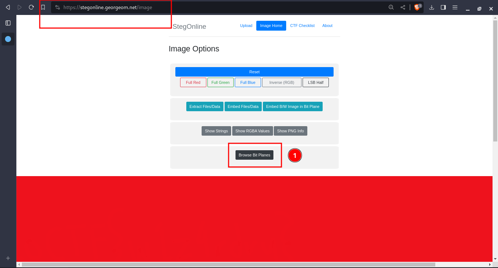

---
tags:
  - forensics
points: 100 points
---

[<-- Forensics Write-ups](../writeup-list.md)

# advanced-potion-making
## Write-up

##### Concept Coverage :
This challenge is introduction to PNG headers.

##### Following are the steps for the challenge: 
1. We are given a file (we don't know the type yet) as the part of the challenge. In my case the file is called `advanced-potion-making` but it might change in future.

2. Upon openning the file in the file in the hex editor I found that the file is `PNG` looking at the inital few bytes of the file header and also I found `IHDR` bytes and `sRGB` bytes at begining of the file as well as `IEND` bytes at the end of the file. The inital header seems to corrupted as suggest by the challenge description. In my case I used an online hexeditor called [hexed.it](https://hexed.it/).

    

    

3. I used the [PNG Headers from Wikipedia](https://en.wikipedia.org/wiki/PNG) to fix the header. Looking at the first few bits they are `89 50 42 11 0D 0A 1A 0A` but a standard PNG should have `89 50 4E 47 0D 0A 1A 0A`. Upon fixing that Upon opening the file we get `Invalid IHDR` error.

    

    

4. I noticed the `IHDR` length is incorrect. The value in the given file is `00 12 13 14` where as it is suppose to tell the length of the `IHDR` chunck which is `13 bytes` as per the `PNG header` so I updated the value to `00 00 00 0D` which represents `13` as length.

    

5. Upon fixing the `IHDR Length` value, when I open the file I only saw a full red image.

    

6. Since We got a full red image I assumed it was stegnography. I used an open-source online tool called [stegOnline](https://stegonline.georgeom.net/upload). Once I uploaded the image there I clicked on the `Browse Bit Plane` to analyze the PNG on diffrent planes

    

7. Upon navigating to the `Red 0` we see the flag (I have blurred the flag for writeup purpose). we can submit the flag and complete the challenge.

    