---
tags:
  - forensics
points: 40 points
---

[<-- Forensics Write-ups](../writeup-list.md)

# tunn3l v1s10n

## Write-up
##### Concept Coverage :
This challenge covers concepts of file headers for BMP. Also covers the concept of file sizes and image dimensions 

##### Following are the steps for the challenge: 
1. We are provided an image with the challenge. Upon downloading it and trying to open it we get the following error : 
    
    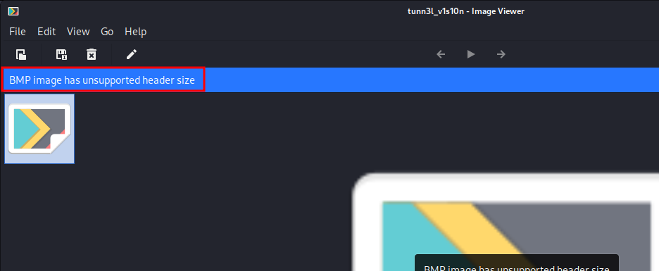
    
2. Now that we know that the BMP image has wrong headers lets try and fix it. In order to fix header I need to use a hex editor. I am using an online one called [hexed.it](https://hexed.it/) but you can use any other hex editor `HxD` for windows or `xxd` / `hexedit` in terminal.
   
3. Upon opening the file in hex editor we notice the issue with the headers :
    
    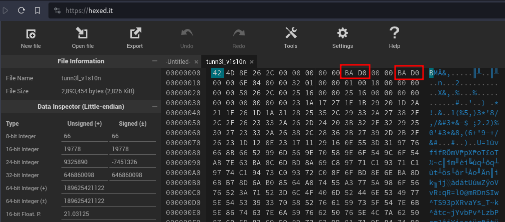
    
4. In order to understand the BMP headers I refered to [wikipedia for BMP](https://en.wikipedia.org/wiki/BMP_file_format) . First thing to notice is that values here are in hex in little endian format.
   
5. lets divide the first header portion as per the BMP header info on wikipedia. We get the following mapping.
    
    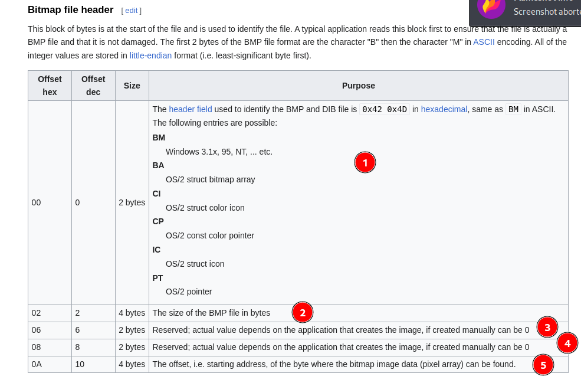
    
    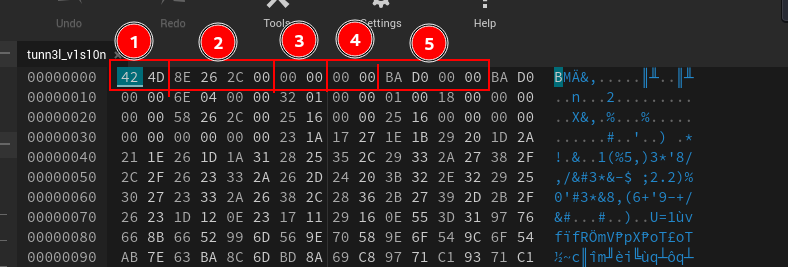
    
6. Upon checking all the other values are correct except for Starting address offset (Pointer 5). upon using an online convertor we can see the current offset for image bits is set wrong. The value for point 5 should be `36 00 00 00` instead of `BA D0 00 00` as we notice that image-data bytes start at address `00 00 00 36` in hex editor and since headers in little endian bytes are written in reverse so `36 00 00 00`
    
    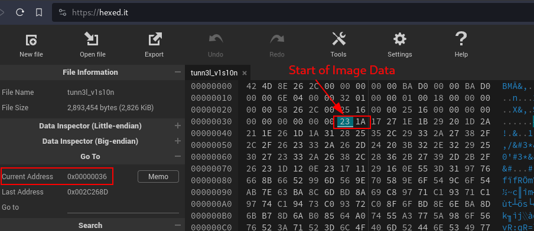
    
7. For the next set of misconfigured header we notice that the value should have be 40 in decimal at all times. which is equivalent to `28 00 00 00` in hex little endian instead of `BA D0 00 00` so lets update that  as well. 
    
    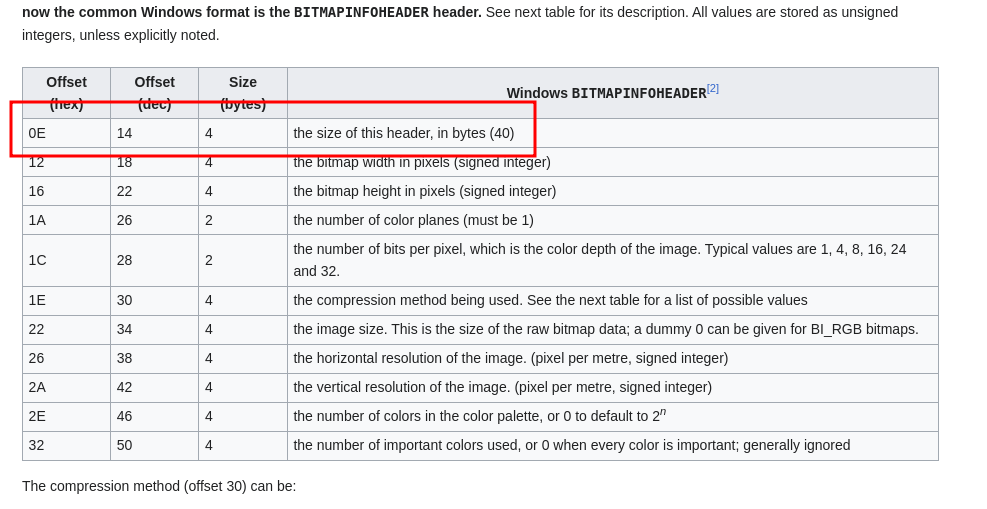
    
    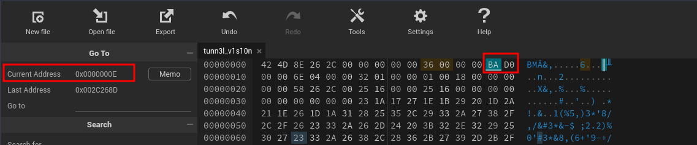
    
8. Upon updating the headers, file looks like following. 
    
    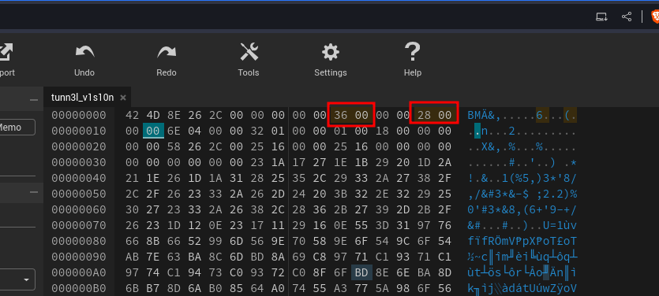
    
9. Upon saving and opening the file we get the following :
    
    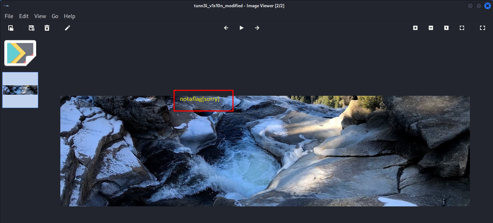
    
10. Now that file is fixed, lets take a look at metadata of the file to see if anything else we are missing. We notice that dimension that file size is roughly around 3 MB and from the dimension of the image and bit size it seems we are not able to view the full image.
    
    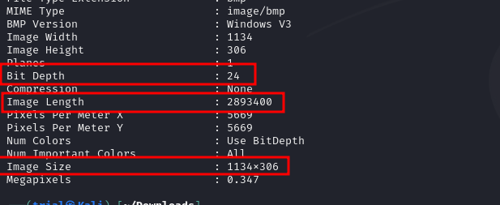
    
    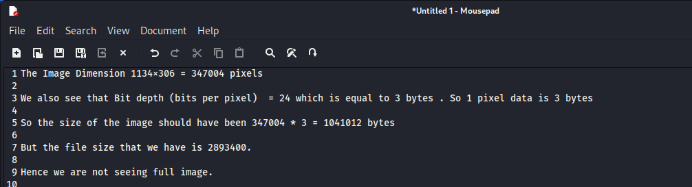
    
11. lets set height of the image to `850` (see calcuations below) and see if we can get more information . for this we can update the height field in hex editor from `32 01 00 00` (little-endian value) which is equal to `52 03 00 00`  which is 850 decimal. 
     
     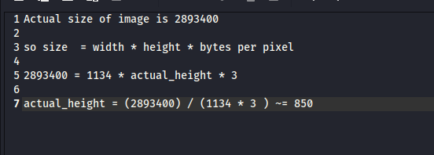
     
     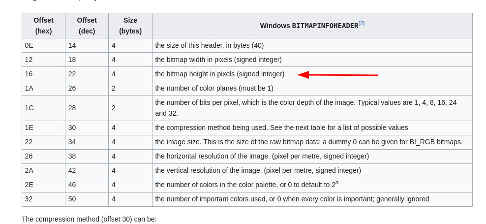
     
     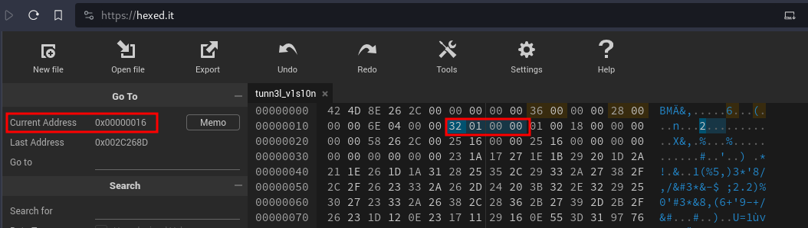
     
12. Final updated file looks like following (includes header updates and height change) : 
    
    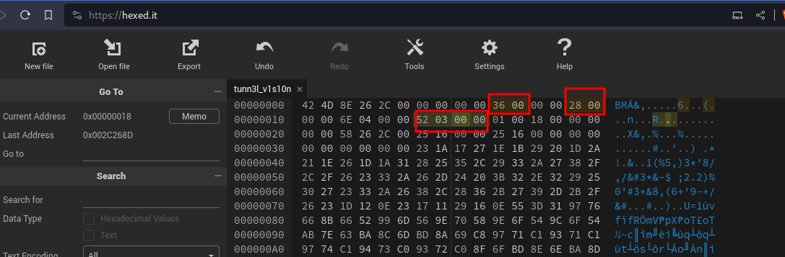
    
13. Upon opening the updated file we the following and we notice the flag written on the image. I blurred out the flag, it is clear in the actual image.
    
    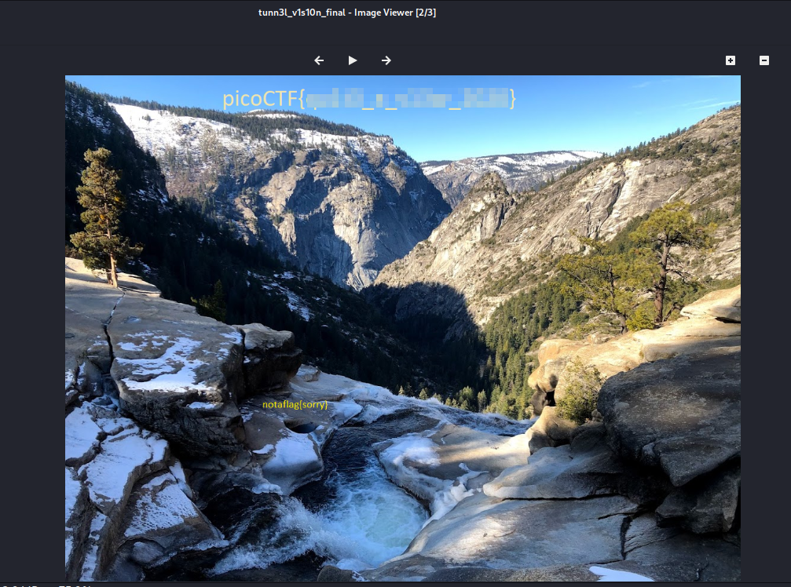