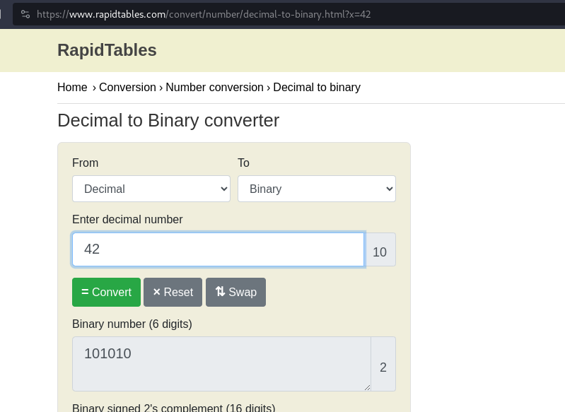

---
tags:
  - general-skills
points: 50 points
---

[<-- General Skills Write-ups](../writeup-list.md)

# 2Warm
## Write-up

##### Concept Coverage :
This was a introduction to convert Decimal to Binary

##### Following are the steps for the challenge: 
1. We are asked what would Decimal value (base 10) `42` represent in Binary (base 2)
   
2. We can use the below bash code to get the output. 
   
    ```bash
    echo "obase=2;42" | bc
    ```

    ```bash
    python -c 'print(bin(42))'
    ```

3. You can also use online tool like [rapidtables](https://www.rapidtables.com/convert/number/decimal-to-binary.html) for quick solve. 
    
    

4. You can replace `42` with a different Decimal value as asked by your challenge and you just need to wrap the response with `picoCTF{}` and submit the flag.