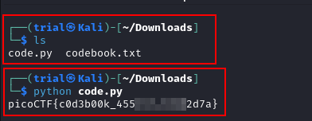

---
tags:
  - general-skills
points: 100 points
---

[<-- General Skills Write-ups](../writeup-list.md)

# Codebook
## Write-up

##### Concept Coverage :
This challenge is basic Python code execution challenge

##### Following are the steps for the challenge: 
1. We are given a Python code script and a text file as a part of challenge. At the the time of writing Python file was called `code.py` and Text file was called `codebook.txt` but those might change in future.

2. The challenge asks us to `run the python script by keeping the text file in same directory`. so I downloaded both files and ran the python code after ensuring both the files are in the same directory. Upon running the code we get the flag. We can submit that flag mark that challenge as done.

    

3. Just out of curousity I decided to look at the python file. Upon a quick lookthrough it has a function called `str_xor()` which takes the `flag_enc` variable value as the encoded_flag and reads the `codebook.txt` and uses the string in it as a password to decode the `flag_enc` using `str_xor()` function.