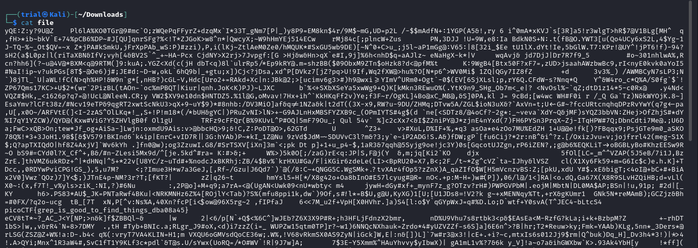
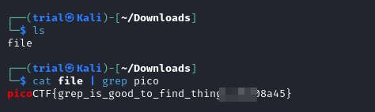

---
tags:
  - general-skills
points: 100 points
---

[<-- General Skills Write-ups](../writeup-list.md)

# First Grep
## Write-up

##### Concept Coverage :
This challenge is introduction to the concept of the `grep`

##### Following are the steps for the challenge: 
1. We are given a file with the challenge to look for the flag. The file is called `file` in my case.

2. Upon downloading and reading the file I found out there is a lot of text and as a the challenge name suggests we might be able to use `grep` to get the flag.

    

3. So I used the below command the only get the flag.

    ```bash
    cat file | grep pico
    ```

    
