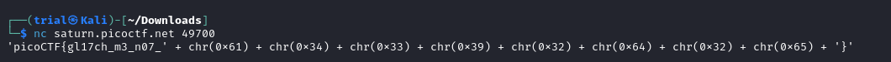
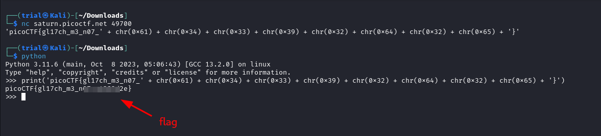

---
tags:
  - general-skills
points: 100 points
---

[<-- General Skills Write-ups](../writeup-list.md)

# Glitch Cat
## Write-up

##### Concept Coverage :
This challenge is introduction to `hex` to `ASCII` conversion in python.

##### Following are the steps for the challenge: 
1. We are given a `netcat` connection details with the program. At the time of writing it was `nc saturn.picoctf.net 49700` but this might change in future.

2. Upon running the `netcat` connection we get the flag but some part of it doesn't seem to converted to `ASCII` chatracters as we still see `chr()` function. 

    

3. Since `chr()` is a python function and also taking a general look at the output string it seems to be a valid python string just that the `chr()` elements never ran. So I tried running the output through python's `print()` and I get the flag. We can submit the flag to complete the challenge

    
