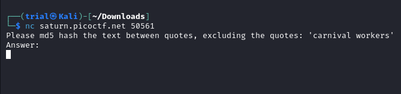
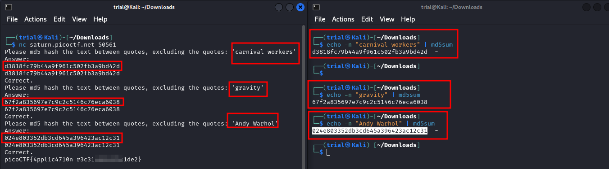

---
tags:
  - general-skills
points: 100 points
---

[<-- General Skills Write-ups](../writeup-list.md)

# HashingJobApp
## Write-up

##### Concept Coverage :
This challenge is introduction to [MD5](https://en.wikipedia.org/wiki/MD5) hashing

##### Following are the steps for the challenge: 
1. We are given a netcat conenction link with the challenge. At the time of writing it was `nc saturn.picoctf.net 50561` but this might change in the future

2. Upon conencting to the netcat connection we can see it is hosting an application which asks us to input the `md5` hash value of a string mentioned in the line

    

3. So I opened a second terminal and used a linux command line utility called `md5sum` to generate the `md5` hash for the strings . Upo doing so 3 times I got the flag

    

    ```bash
    echo -n "<string-here>" | md5sum
    ```
