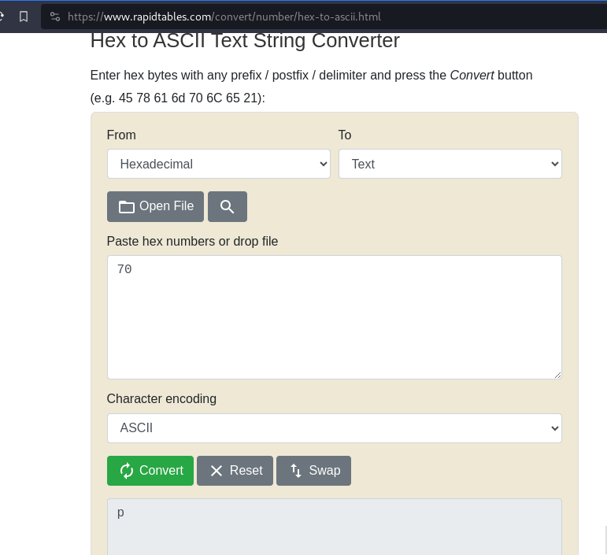

---
tags:
  - general-skills
points: 50 points
---

[<-- General Skills Write-ups](../writeup-list.md)

# Lets Warm Up
## Write-up

##### Concept Coverage :
This was a introduction to convert hex to ASCII

##### Following are the steps for the challenge: 
1. We are asked what would hex value `0x70` represent in ASCII
   
2. We can use the below bash code to get the output
   
    ```bash
    echo -e '\x70'
    ```

    ```bash 
    python -c 'print(chr(int("70", 16)))'
    ```

3. You can also use online tool like [rapidtables](https://www.rapidtables.com/convert/number/hex-to-decimal.html) for quick solve.
    
    
   
4. You can replace `70` with a different hex value as asked by your challenge  and you just need to wrap the response with `picoCTF{}` and submit the flag.