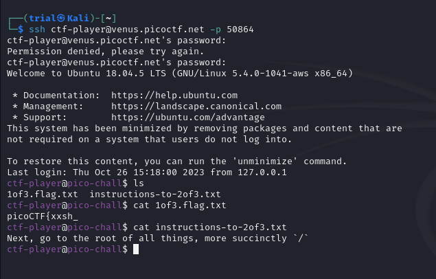
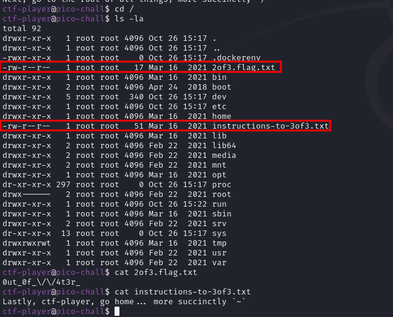
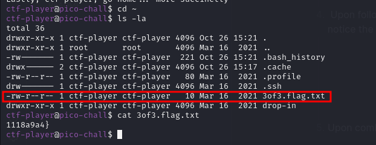

---
tags:
  - general-skills
points: 30 points
---
# Magikarp Ground Mission

## Write-up
##### Concept Coverage :
This challenge covers the basic linux concepts to navigate and find flag files in the provided server. 

##### Following are the steps for the challenge: 
1. We are given a server instance and instructions to ssh in to the machine with the challenge
2. Once you ssh into the server you can find the flag 1 file present in the location where you are dropped after ssh. we also find instruction to the 2nd flag file
    
    
    
3. upon navigating to `/` we do a `ls -la` and and we notice the 2nd flag file as well as instructions to 3rd flag file. We also notice that although file is owned by root there is read permission on those file to other users as well
    
    
    
4.  Upon following the instructions for 3rd flag and navigating to `~` and doing a `ls -la` we notice the 3rd flag file
    
    
    
5. Upon combining the output from all three flag files we get the full-flag.