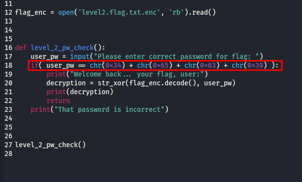

---
tags:
  - general-skills
points: 100 points
---

[<-- General Skills Write-ups](../writeup-list.md)

# PW Crack 2
## Write-up

##### Concept Coverage :
This challenge is similar to challenge [PW Crack 1](../PW%20Crack%201/writeup.md) with a few added extra steps.

##### Following are the steps for the challenge: 
1. We are given a python script and an encoded file containing the flag. At the time of writing the python script was named `level2.py` and encrypted flag file named `level2.flag.txt.enc` but this might change in future.

2. After downlaoding, I opened up the python script in an editor to read through the python file. we notice that we have open the `level2.flag.txt.enc` file and then it calls on the `level_2_pw_check()` function which takes `user_pw` as user input and then it validates if the input is equal to `8713`. if the validation succeeds it executes `str_xor()` function which seems to doing the decoding of the text from the `level2.flag.txt.enc`.

    - main function : 

      

    - str_xor function : 

      

3. I closed the editor and ran the script. Before running the script I ensured my `level2.flag.txt.enc` file is in same directory as `level2.py` python script. Upon running the script it asked for the password.From the main function we can see that it compares the input string with the string formed from `chr(0x34) + chr(0x65) + chr(0x63) + chr(0x39)`. In order to simplify I added a print line above input statement to print the string for us .

    

4. As soon as we enter the password that gets printed out due our added print line , it gives us the flag.

    

5. We can submit the flag and complete the challenge
