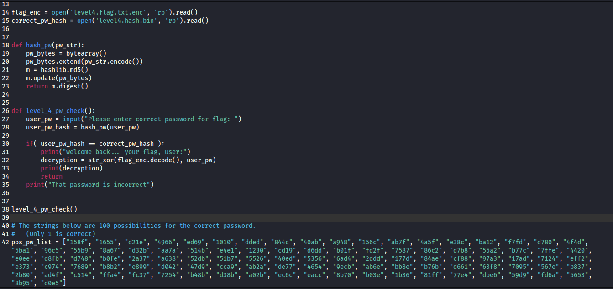
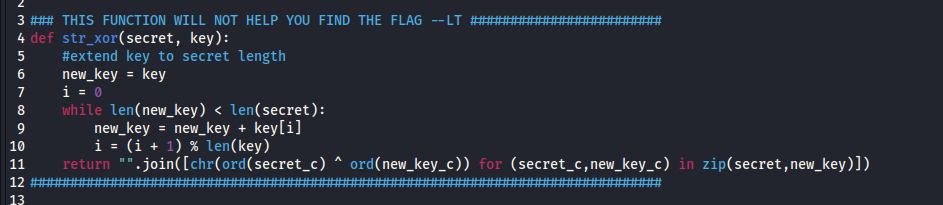
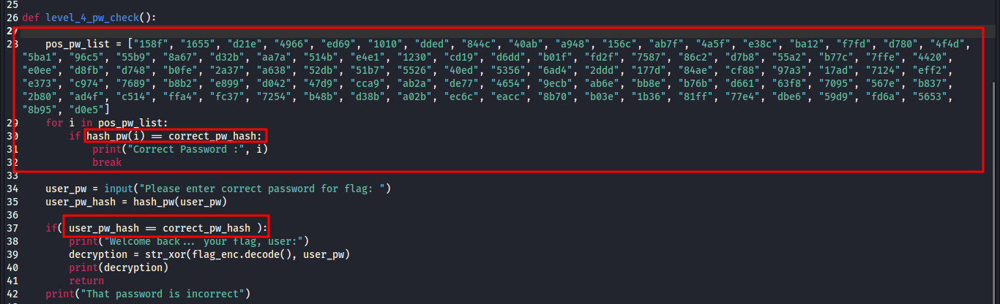
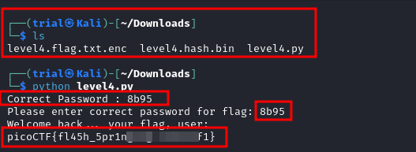

---
tags:
  - general-skills
points: 100 points
---

[<-- General Skills Write-ups](../writeup-list.md)

# PW Crack 4
## Write-up

##### Concept Coverage :
This challenge is similar to [PW Crack 3](../PW%20Crack%203/writeup.md).

##### Following are the steps for the challenge: 
1. We are given a python script, an encoded file containing the flag and a hash binary file. At the time of writing the python script was named `level4.py`, encrypted flag file named `level4.flag.txt.enc` and a hash binary file containg the hash for the correct password called `level4.hash.bin` but this might change in future.

2. After downlaoding, I opened up the python script in an editor to read through the python file. we notice that we have open the `level4.flag.txt.enc` file and then it calls on the `level_4_pw_check()` function which takes `user_pw` as user input and hashes it with `hash_pw()` function and then it validates if the input is equal the value from the hash binary file `level4.hash.bin`. if the validation succeeds it executes `str_xor()` function which seems to doing the decoding of the text from the `level4.flag.txt.enc`. We are also given a list of possible password out of which one is correct

    - main function, hash function and password check function : 

      

    - str_xor function : 

      

3. I closed the editor and ran the script. Before running the script I ensured my `level4.flag.txt.enc` file is in same directory as `level4.py` python script. Upon running the script it asked for the password.From the main function we can see that it hashes and compares the input string with the string from `level4.hash.bin`. In order to simplify I added few lines to `level_4_pw_check()` function to print the correct password string for us from the list.

    

4. As soon as we enter the password that gets printed out due our updated function, it gives us the flag.

    

5. We can submit the flag and complete the challenge

