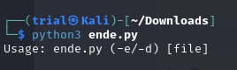

---
tags:
  - general-skills
points: 10 points
---

[<-- General Skills Write-ups](../writeup-list.md)

# Python Wrangling

## Write-up
##### Concept Coverage :
This challenge is an introduction to the Python . it also covers the basics of [Fernet](https://cryptography.io/en/latest/fernet/) encryption. The flag file contains the encrypted file and we are provided the python file using Fernet encryption and decryption method present within. We are also provided a password file which was used as an encryption key

##### Following are the steps for the challenge: 
1. Download all the files from the challenge. it should have 3 files in total : Python Script , Password File and Flag file with encrypted flag
2. Upon inspecting a few things stand out from the Python Script : 
	1. First at the beginning we notice it has help function : 
	   
	   .png)
	    
	2. The other thing that stands out of what seems decryption function : 
	   
	   .png)

3. Upon running the Python Script without argument we get the help text on how to use the script :
```bash
python3 <name-of-python-script>.py 
```

 

4. Upon reading the help text and the decryption function we can understand that we can run python script with -d flag to decrypt an encrypted text which can be passed as an argument after the -d flag
```bash 
python3 <python-script>.py -d <encrypted-flag-file>
```

5. Upon running it will ask for password which can be found in the password file provided with the challenge. Upon entering password, it will print out the decrypted flag on the terminal.
