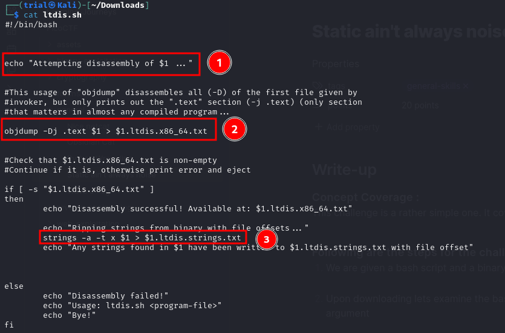
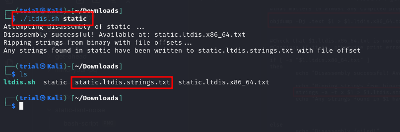
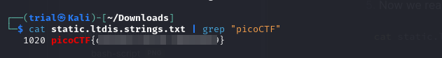
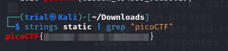
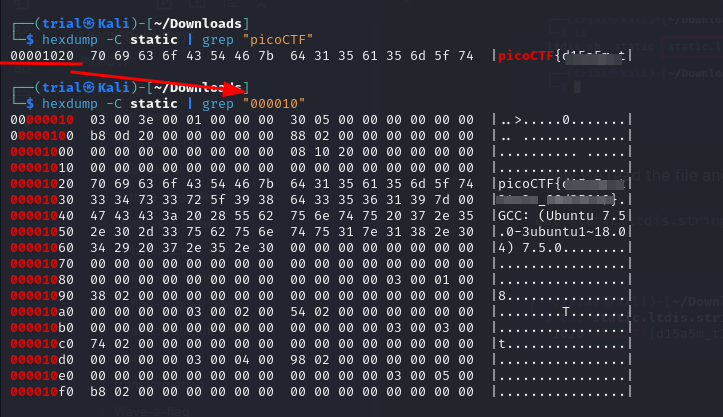

---
tags:
  - general-skills
points: 20 points
---

[<-- PicoCTF Category Table](../../README.md#2-picoctf)

# Static ain't always noise

## Write-up
##### Concept Coverage :
This challenge is a rather simple one. It covers basics of object dump 

##### Following are the steps for the challenge: 
1. We are given a bash script and a binary executable for the challenge.
   
2. Upon downloading lets examine the bash script. we notice the following things in the bash script takes place by following steps:
    1. It takes a file as an argument (screenshot marker 1).
    2. The objdump takes the file given as argument it will be disassemble the file and extract the text and put into another file named "(file-name).ltdis.x86_64.txt" 
    3. The newly generated file "(file-name).ltdis.x86_64.txt" is given to linux command `strings`  to store all the strings from the "(file-name).ltdis.x86_64.txt" 
    4. Although , the value in "(file-name).ltdis.x86_64.txt" are present in hex offset and not actual characters so we have to pass `-t x`  flag to strings command that will read the hex offset and store the output as normal text in "(file-name).ltdis.strings.txt" file
       
    

3. In order to run the script you need to make the script executable it can be done by following command
   
```bash
chmod u+x <name-of-bash-script>
```

4. Now we can run the script using the below command and then we can pass the binary file as an argument . this will generate the final stings file.
    
    

5. Now we read the file and try to find the flag in the output of strings : 
    
    
    
```bash
cat <name-of-strings-output-file> | grep "picoCTF"
```


## Alternative Methods :

### Alt-method 1 :
1. since flag is already present in the original binary as a string we can just leverage linux command `string` directly on the binary and that would give us the flag
    
    
### Alt-method 2: 
1. since it is a binary we can also leverage the `hexdump` command to get the same result : 
    
    