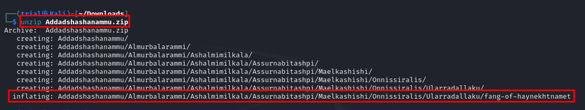
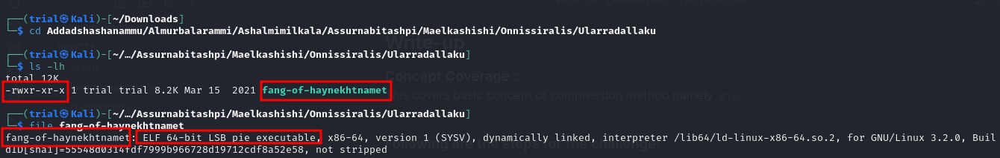
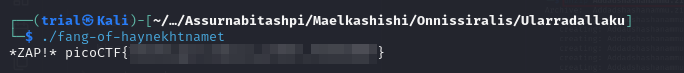
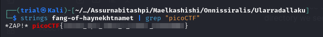

---
tags:
  - general-skills
points: 20 points
---

[<-- General Skills Write-ups](../writeup-list.md)

# Tab Tab Attack

## Write-up
##### Concept Coverage :
This covers basic concept of compression method namely [`zip`](https://en.wikipedia.org/wiki/ZIP_(file_format)) . 

##### Following are the steps for the challenge: 
1. Download the zip file provided with the challenge.
2. Upon unzipping we notice that we get a directory with multiple level 
    
    
    
    ```bash
    unzip <name-of-zip-file>
    ```

3. We also notice that we see a file at at the end of zip extraction . Upon navigating to that directory we see it is a linux binary file and it has execute permissions
    
    

4. Upon executing that file we get the flag 
    
    
    
    ```bash
    ./<name-of-the-file>
    ```

5. Alternatively, you can also use `strings` command to extract flag from the binary as well  if you are not willing to run the binary 
    
    