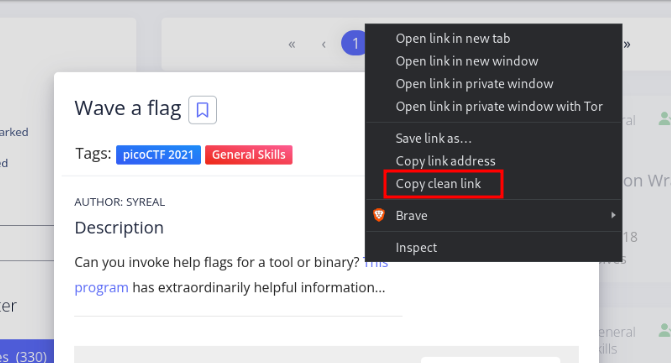
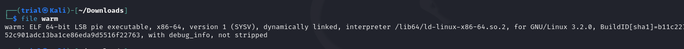
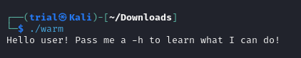
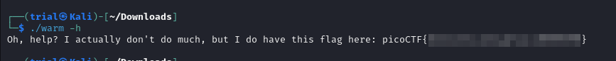
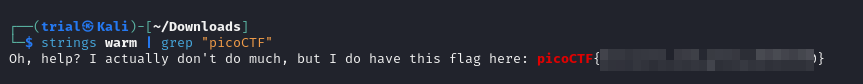

---
tags:
  - general-skills
points: 10 points
---

[<-- General Skills Write-ups](../writeup-list.md)

# Wave a flag

## Write-up

##### Concept Coverage :
This is a simple challenge involving the permission on a linux file. The challenge provides a linux executable file with no extension and the file does not executable permission set on the file. 

##### Following are the steps for the challenge: 
1. Download the file onto your linux machine. 
    If you are using webshell provided by picoCTF you can leverage [wget](https://www.geeksforgeeks.org/wget-command-in-linux-unix) command. 
    Link to the file can be copied from the website by right-clicking on the link and clicking on "copy clean link"
    
    

``` bash
wget <link-to-the-file>
```

2. once you have file downloaded and navigate to the file. Since it doesn't have a extension we can use [file](https://www.geeksforgeeks.org/file-command-in-linux-with-examples/) function in linux to determine the type of file. The output shows that it is a linux executable binary file
   
``` bash
file <name-of-downloaded-file>
```
   
   

3. Although file is a linux binary executable it is missing the execute permission on the file. we can make that file executable by use of [chmod](https://www.geeksforgeeks.org/chmod-command-linux/) and adding execute permission for our user. 
   
``` bash
chmod u+x <name-of-file>
```

4. once you have added the permission you can run the linux binary in terminal
   
``` bash
./<name-of-file>
```

5. Upon running we get following output : 
   
   

6. as suggested by the output. once we run it with the -h flag . it gives us the flag 
   
   

### Alternative method
1. Once you have the file downloaded you can also leverage [strings](https://www.javatpoint.com/linux-strings-command) and [grep](https://www.geeksforgeeks.org/grep-command-in-unixlinux) to extract the flag from the file. 
   
```bash
strings <name-of-the-file> | grep "picoCTF"
```

output : 



