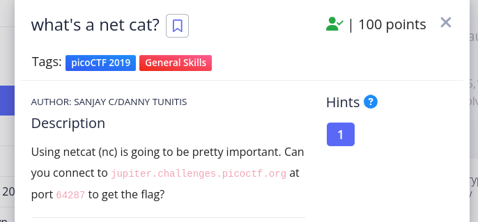

---
tags:
  - general-skills
points: 100 points
---

[<-- General Skills Write-ups](../writeup-list.md)

# Whats a netcat
## Write-up

##### Concept Coverage :
This challenge is introduction to [netcat](https://netcat.sourceforge.net/). it covers on how to basically connect to a computer on a specific port using netcat

##### Following are the steps for the challenge: 
1. In the challenge description we are given a connection details (`URL` and `Port`). At the time of writing the `URL` was `jupiter.challenges.picoctf.org` and `Port` given to connect is `64287`.

    

2. Upon connecting with given connection details using netcat (`nc` command for linux) we get the flag. We can submit the flag and complete the challenge.

    

    Netcat(nc) command :

    ```bash
    nc <connection-url> <port-number>
    ```