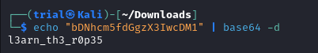

---
tags:
  - general-skills
points: 100 points
---

[<-- General Skills Write-ups](../writeup-list.md)

# bases
## Write-up

##### Concept Coverage :
This challenge is gives us intoduction to the `base64` conversion

##### Following are the steps for the challenge: 
1. We are given a string as part of the challenge. At the time of writing the string was `bDNhcm5fdGgzX3IwcDM1`.

2. As the title of the suggests the string has to do something with bases. Since `base64` is most commanly used I tried to decode it using `base64` using the following command : 

    ```bash
    echo "<string>" | base64 -d
    ```

    

3. As the challenge suggests we need to wrap the text in `picoCTF{}` and submit as a flag to complete the challenge.
