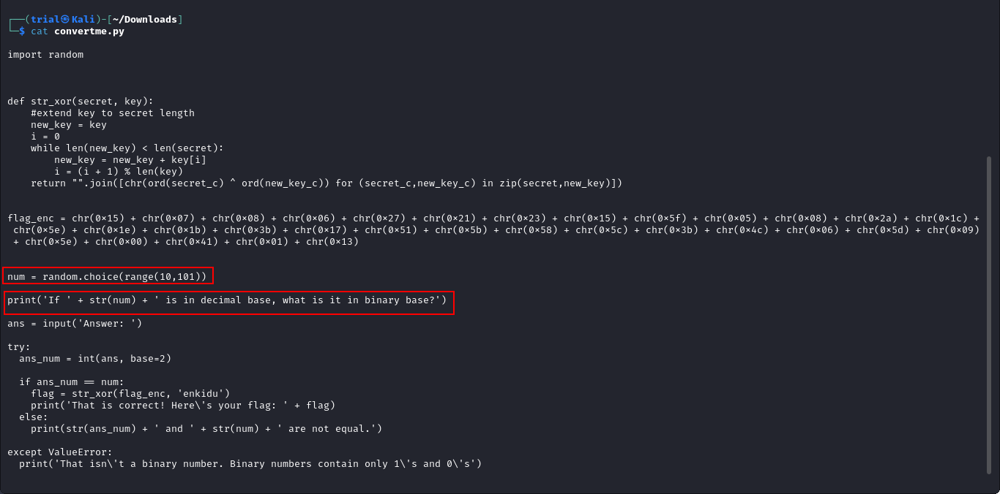

---
tags:
  - general-skills
points: 100 points
---

[<-- General Skills Write-ups](../writeup-list.md)

# convertme.py
## Write-up

##### Concept Coverage :
This challenge is related to conversion of decimal to binary. This is a simple challenge was part introductory CTF challenge called `beginner picomini 2022`.

##### Following are the steps for the challenge: 
1. We are given a python script with the challenge. The description also says we would have to convert a given number from decimal to binary. At the time of writing the python script was named `convertme.py` but this might change in the future.

2. Upon running the python script after downloading, we can see the number that we need to convert to binary from decimal is randomly generated during each run between `10` and `100`.

    

3. Knowing thaat we might a random number each run I kept another terminal open to help me convert the number from decimal to binary. I used a linux utility called `bc` (basic calculator) but you can also leverage online websites for the conversion 

    

    - Replace the `<number-from-python-script>` with the number in below command to convert the number from decimal to binary. in my case it was 19 that I got by running python script. and then I copied the output to the terminal where it was asking me to enter binary binary value of `19`

      ```bash
      echo "obase=2;<number-from-python-script>" | bc
      ```

    - Code to run python script. `convertme.py` file name might change in the future.

      ```bash
      python convertme.py
      ```
