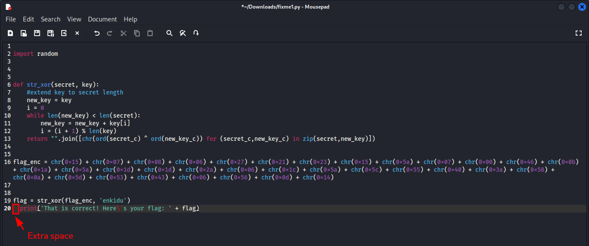

---
tags:
  - general-skills
points: 100 points
---

[<-- General Skills Write-ups](../writeup-list.md)

# fixme1.py
## Write-up

##### Concept Coverage :
This challenge is introduction to python and addressing basic error to make it run without error.

##### Following are the steps for the challenge: 
1. We are given a python script with the challenge. At the time of writing the python script was called `fixme1.py`

2. Upon running the `fixme1.py` script, we get an intentation error. 

    

3. Since it is an intentation error let's open and edit the file. Error also mentioned it was on `line 20`. Looking at it I found the `print()` was intented when it should not have been

    

4. Upon fixing that and running the script again we get the flag.

    

    
