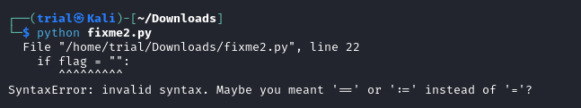
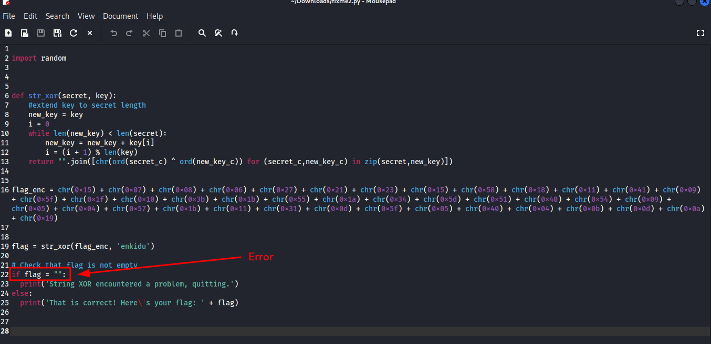
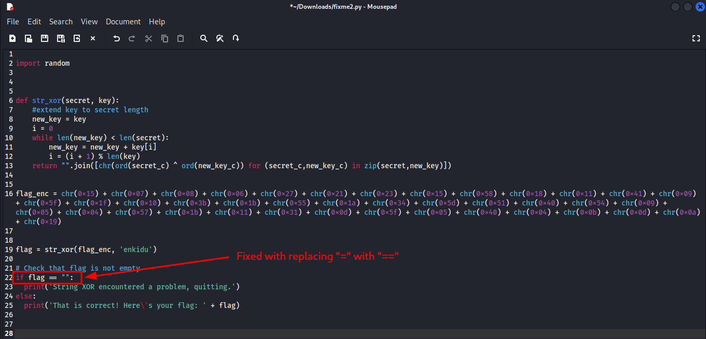
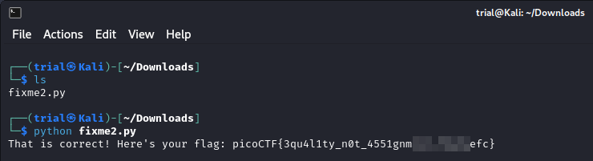

---
tags:
  - general-skills
points: 100 points
---

[<-- General Skills Write-ups](../writeup-list.md)

# fixme2.py
## Write-up

##### Concept Coverage :
This challenge is simialar to previous challenge [fixme1.py](../fixme1.py/writeup.md)

##### Following are the steps for the challenge: 
1. We are given a python script which has a syntax error. Once we fix the error and run the python script we should get the flag. At the time of writing the python script was called `fixme2.py` but that might change.

2. Upon downloading and running the python scriptwe see the error. In the `if` comparision they have used `=` instead of `==` for comaprision.

    

3. I opened the file in aa text editior and updated the line.

    

    

4. After fixing and saving the file, upon running the script we get the flag.

    
