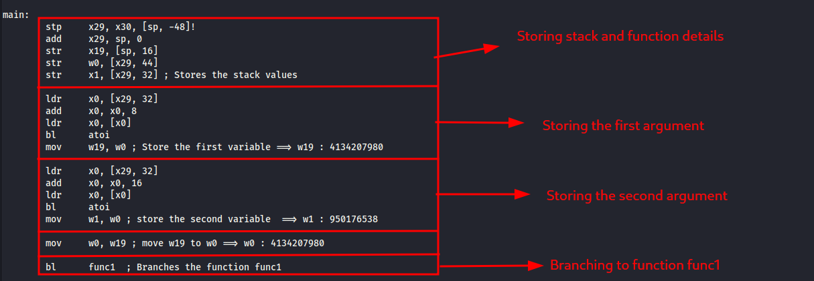
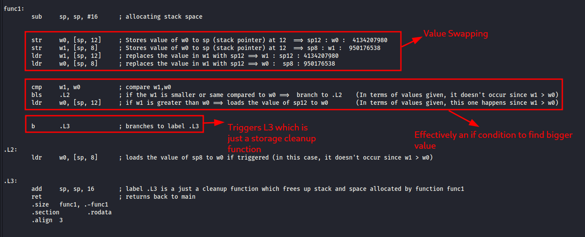
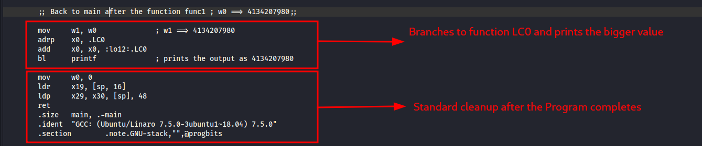
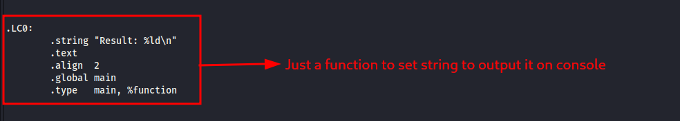
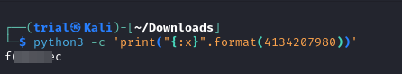

---
tags:
  - reverse-engineering
points: 40 points
---

[<-- Reverse Engineering Write-ups](../writeup-list.md)

# ARMssembly 0

## Write-up
##### Concept Coverage :
This challenge is an introduction to [ARM Assembly code](https://developer.arm.com/documentation/dui0068/b/ARM-Instruction-Reference) used by [ARM](https://en.wikipedia.org/wiki/ARM_architecture_family) microprocessors.

##### Following are the steps for the challenge: 
1. We are given a file with the ARM assembly code an its respective arguments that are passed in the code. In my case the ARM assembly code file is called `chall.S` with the arguments to the file `4134207980` and `950176538`.
   
2. Lets take a look at the ARM assembly code. The code starts with the main function when the program is executed. I have tried to segregated the starting portion of the code. It initially allocates the stack space and then takes inputs for the functions. I have added comments and also refactored the code to make it more readable in screenshot for easier understanding
    
    
    
3. After the function `func1` is called , lets take a look at the working on function `func1` 
    
    
    
4. Then executions switches back to main and the main completes its execution by triggering `LC0` function which just prints the result . 
    
    
    
    
    
5. Now that we know that the output value is `4134207980` in order to get the flag as mentioned in the challenge description we need to get the hex value of it without `0x` in the beginning and 32 bits. we can get that simply using the below python command directly from bash.
```bash
python3 -c 'print("{:x}".format(4134207980))'
```

6. Upon running the above command we get the hex value of it . we just need to wrap it with `picoCTF{}` and we can submit the flag .
    
    
   