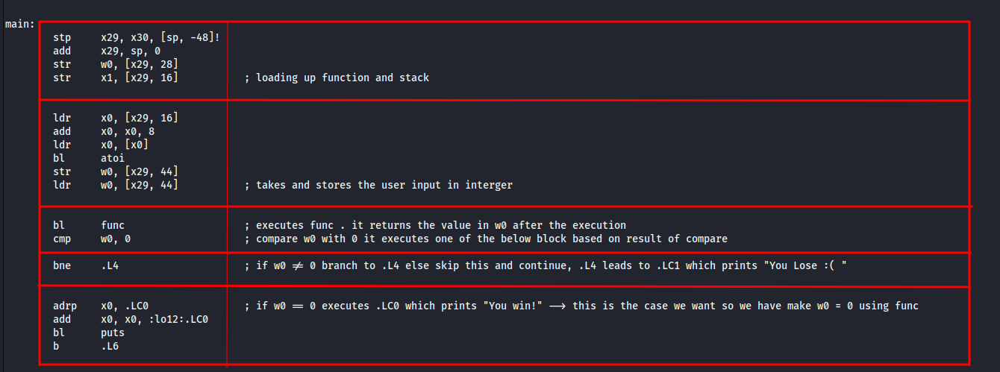
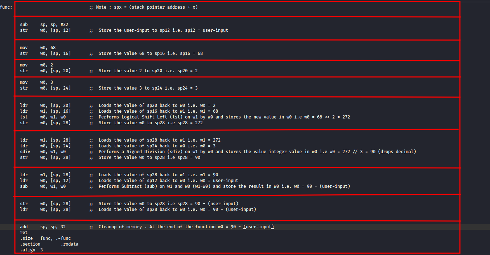
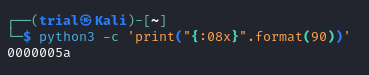

---
tags:
  - reverse-engineering
points: 70 points
---

[<-- Reverse Engineering Write-ups](../writeup-list.md)

# ARMssembly 1
## Write-up

##### Concept Coverage :
This challenge is the enxtension of the previous challenge named [ARMssembly 0](../ARMssembly%200/writeup.md). 

##### Following are the steps for the challenge: 
1. We are provided with the ARM assembly code for the challenge. In my case it is called `Chall_1.S` but this might change in the future. We need to figure which input triggers the win condition in the code and then convert the value into 32-bit hex and wrap it with `picoCTF{}` as a flag.

2. To being with lets open the file and take a look at the `main` function. I have seperated out the different working blocks of the main function in the image below : 

    

3. Based on the image above if we want to succeed we need to have the value stored in `w0` to be `0` after the execution of `func`. So now lets take a look at func and understand the working of that function 

    

4. We notice that at the end of the function `func` the value of `w0` is equal to `90-(user_input)` and from the `main` function we know that in order to trigger the win condition we need `w0 = 0` after execution on `func`. In order to achieve that user input has to be `90`. 

5. Lets convert the integer into 32-bit hex. I used the below mention python snippet to do it. I added `08` in front because each character in hex is 4-bits so we need 8 characters to make the value 32-bit

    ```bash
    python3 -c 'print("{:08x}".format(90))'
    ```

    

6. We just need to wrap the output with `picoCTF{}` and then we can submit the flag to complete the challenge