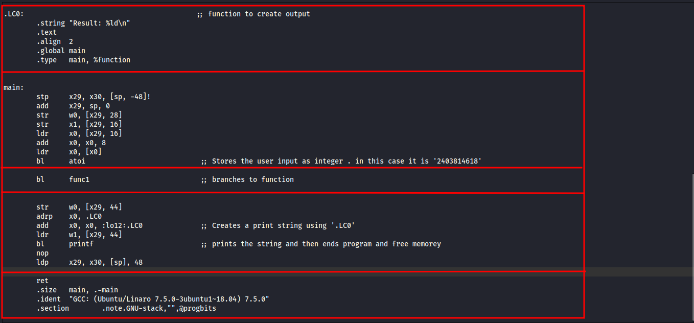
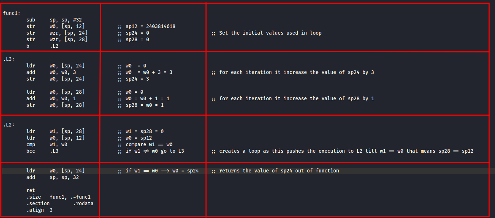
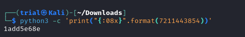

---
tags:
  - reverse-engineering
points: 90 points
---

[<-- Reverse Engineering Write-ups](../writeup-list.md)

# ARMssembly 2
## Write-up

##### Concept Coverage :
This challenge is the enxtension of the previous challenge named [ARMssembly 1](../ARMssembly%201/writeup.md). 

##### Following are the steps for the challenge: 
1. We are provided with the ARM assembly code for the challenge. In my case it is called `Chall_2.S` but this might change in the future. We need to figure out what will be the output when you run the ARM code and convert that to 32 bit hex and wrap it with `picoCTF{}` and submit it as a flag

2. Lets start by taking a look at the code. Firstly we will start with the main function

    

3. Now lets take a `func1` function. That seems to main the component where most things seems to happening. `func1` is essentially a loop. 

    

4. The above `func1` function is equivalent to the below Pseudo code in python

    ```python
    sp12 = 2403814618
    sp24 = 0
    sp28 = 0
    while (sp28 != sp12):
      sp24 = sp24 + 3
      sp28 = sp28 + 1
    print("Result :",sp24)
    ```
5. From the above code we can for each iteration the value of `sp28` is increased by 1 till its equal too `sp12` or `2403814618` iterations will happen. for each iteration the value of `sp24` is incremented by 3 and then in the end the final value of `sp24` is the output of the program. This makes it equal to `sp12*3` which is equal to `2403814618 * 3 = 7211443854`

6. Lets convert the integer into 32-bit hex. I used the below mention python snippet to do it. I added `08` in front because each character in hex is 4-bits so we need 8 characters to make the value 32-bit

    ```bash
    python3 -c 'print("{:08x}".format(7211443854))'
    ```

    

7. if you notice we get 36 bits output since we have 9 characters in output. we need use 32 bits which will be just last 8 chatacters. and then warp those laast 8 characters in `picoCTF{}` and submit the flag to complete the challenge
