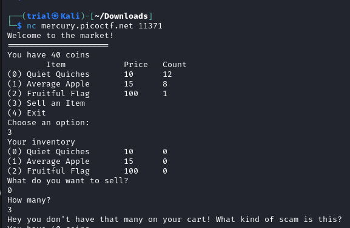
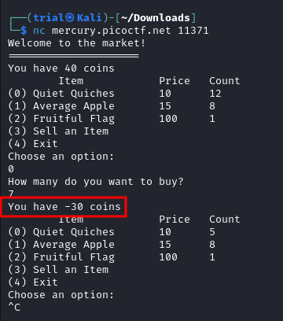
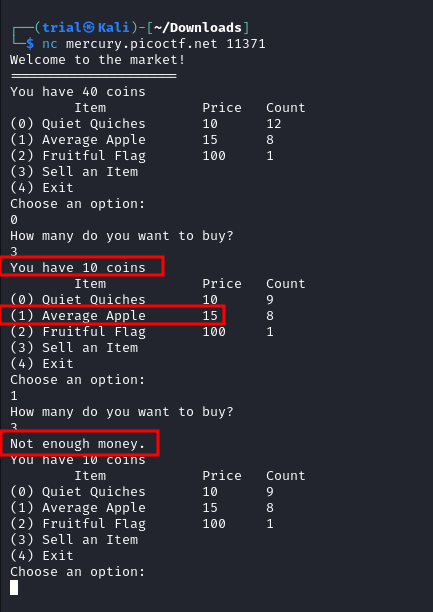
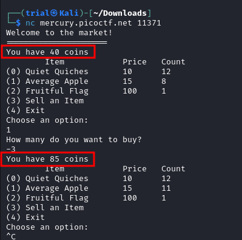
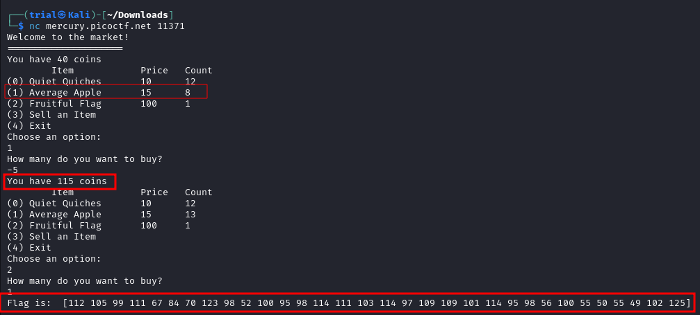
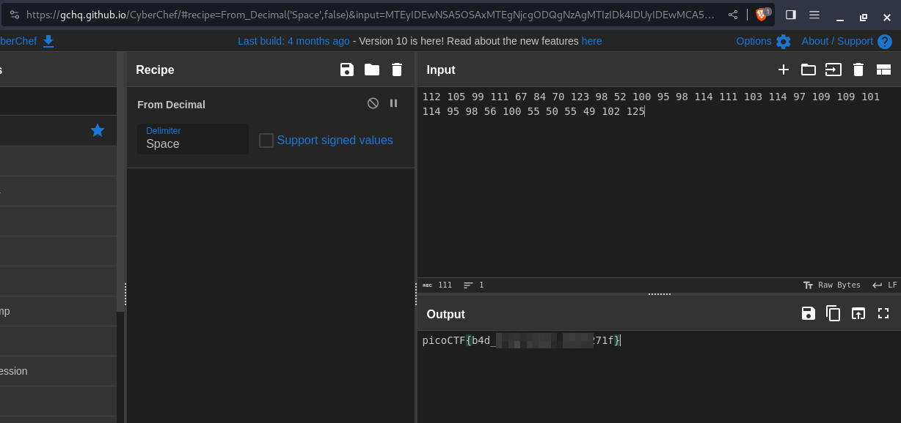
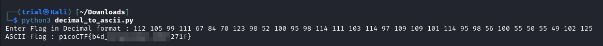

---
tags:
  - reverse-engineering
points: 50 points
---

[<-- Reverse Engineering Write-ups](../writeup-list.md)

# Shop
## Write-up

##### Concept Coverage :
This challenge is cocenpts of input validation and how a code can be misused if not present

##### Following are the steps for the challenge: 
1. we are given a `netcat` connection which hosts a `shop` program. 
    
    
    
2. We are also given a source binary for the `shop` program named "`source`" so we can add executable permission to that file using `chmod` and run it locally do some testing.
    
    ```bash
    chmod +x ./source
	```
	
3. Since it is a binary file we cannot read the source code. I started by exploring with different inputs I notice they don't have a validation check on amount I am allowed to buy. I had `40 coins` and ideally should only be allowed to buy `4 Quiet Quiches` but I was able to buy 7 and that gave me `-30 coins`. 
    
    
    
4. There is validation check of sort. From the testing as long as I have enough to buy one of any item I put any value in the  `How many do you want to buy?` option and I can buy them.
    
    
    
5. Since there is not validation check I assumed that the new value of coin when you buy something is calculated based on equation `new_coins = old_coins - (price_of_item * quantity_of_item)`. using that assumption I tested out a negative value as the `quantity_of_item` to see if I can get extra money and it seem to been working
    
    
    
6. Since we can exploit it I decided to buy enough negative `Average Apple` that I can have more than 100 coins which should let me buy the `Fruitful Flag` . In this case that I would have to buy **negative**  `4` or more of them since I start with `40 coins` I would need `60 or more coins` . After doing that I was able to but the `Fruitful Flag`.
    
    
    
7. The values that we obtained as Decimal values of ASCII characters. we can use [cyberchef](https://gchq.github.io/CyberChef/#recipe=From_Decimal('Space',false)) to convert it back to ASCII doing so gives us our flag.
    
    
    
    If you not interested in using cyberchef you use below mentioned simple python program to achieve the same result :
    
    ```python
    input_text = input("Enter Flag in Decimal format : ")
	flag = ""
	
	for i in input_text.split(" "):
		flag=flag + chr(int(i))
		
	print("ASCII flag :",flag)

	```
	
	