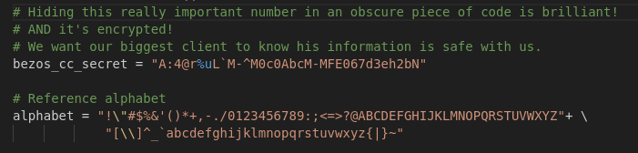
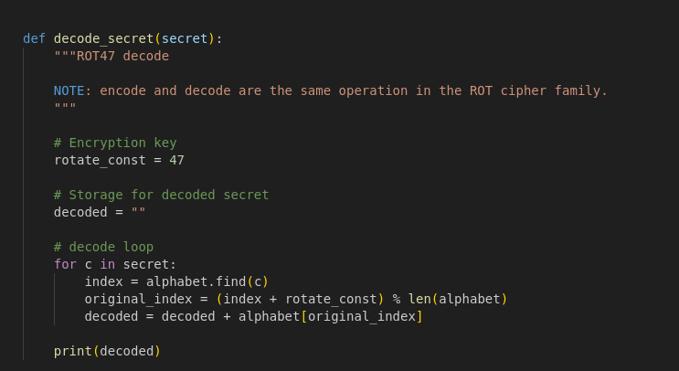
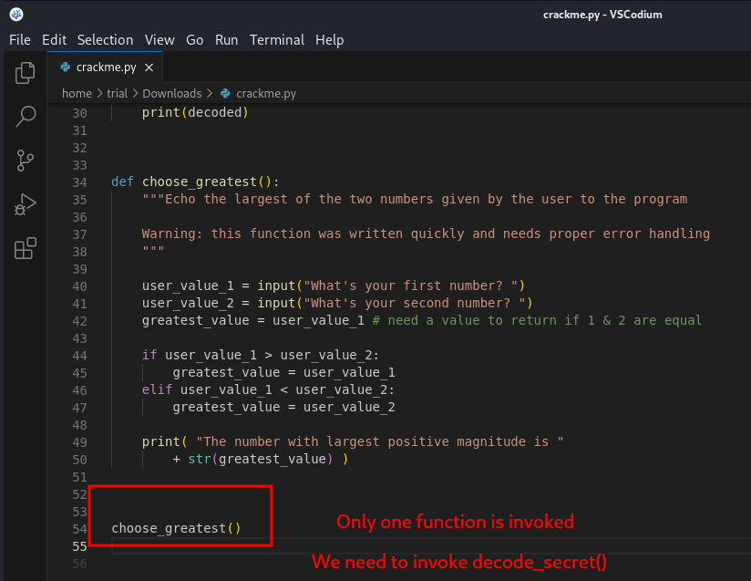
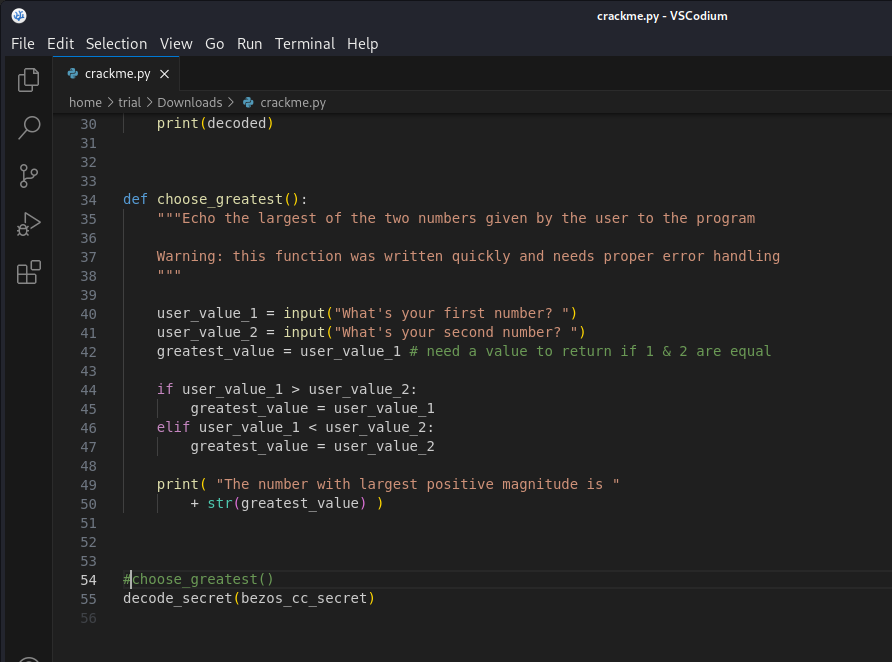
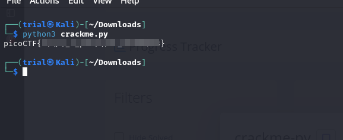

---
tags:
  - reverse-engineering
points: 30 points
---

[<-- Reverse Engineering Skills Write-ups](../writeup-list.md)

# crackme-py

## Write-up
##### Concept Coverage :
This challenge is pretty straight forward and covers the concept of the hidden code

##### Following are the steps for the challenge: 
1. Download the python script given with the challenge. upon reading through the python script a few things standout.
2. Firstly, we have variable that might contain our flag but it seems to be encoded.
    
    
    
3. Secondly, we notice that there is a decode function which seems not to be invoked anywhere in the main function.
    
    
    
4. At last we have a main portion of the python script which run when we executed when we run it
    
    
    
5. As the decode function is never invoked, lets add a method to call `decode_secret` with `bezos_cc_secret` as a parameter so that the method is called we can leverage it to decode. Example : 
    
    
    
6. now upon executing the python script I get the flag : 
    
    

