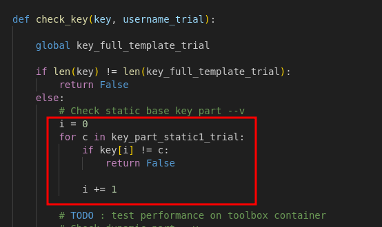
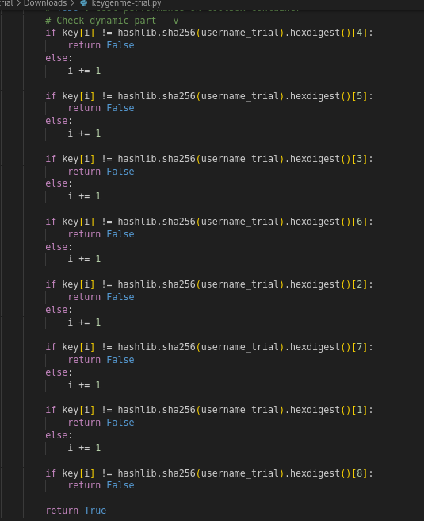

---
tags:
  - reverse-engineering
points: 30 points
---

[<-- PicoCTF Category Table](../../README.md#2-picoctf)

# Keygenme-py

## Write-up
##### Concept Coverage :
This challenge covers the basic understanding of python. The flag is present in the code as key is the license to unlock the full version of given python program 

##### Following are the steps for the challenge: 
1. Download the python script provided with the challenge.
2. Upon opening and going through the file we notice things. Firstly, we notice that we are given full flag except for 1 part.
    
    
    
3. Secondly we notice that there is a `check_key()` function which checks the entered key against the actual key to figure out whether the entered key is valid of not. there are a few things to notice in the `check_key()` function :
    
     1. Initially , there is a loop which checks the entered key with first `key_part_static_trial` character by character so we know that first part of the flag is value of `key_part_static_trial` .
        
        
        
     2. For second part of the key . they take the value of variable `username_trial` and hashes it to SHA256 and picks the character in jumbled order. . we can easily replicate the process to find what out put it generates
        
        
    3. Then we can complete the key by attaching the last part `key_part_static2_trial` which is just `}` .
4. Now that we have a theory in mind lets write a basic code the generate the key. You can try to write your own code from the understanding above or if you want the code you can use this one :  [generate-key.py](../assets/keygenme-py/generate-key.py). Running the program prints the flag.
   
      
