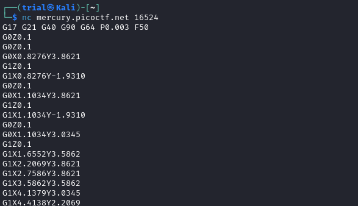
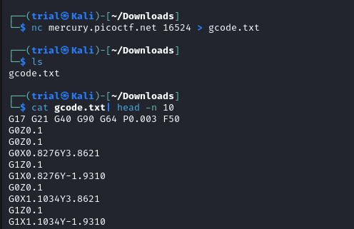
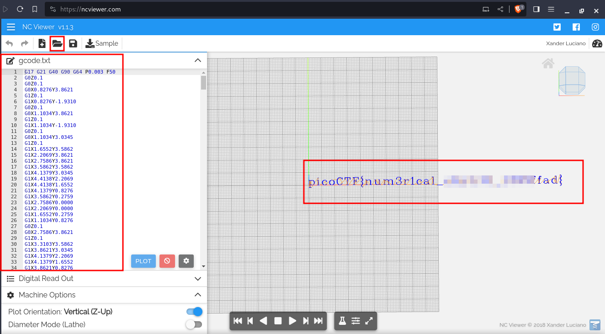

---
tags:
  - reverse-engineering
points: 50 points
---

[<-- Reverse Engineering Write-ups](../writeup-list.md)

# Speeds and Feeds

## Write-up
##### Concept Coverage :
This challenge is an introduction to `G-code` which used by `Computer Numerical Control Machines` mostly known as `CNC Machines` for short. 

##### Following are the steps for the challenge: 
1. we are given a netcat connection with the challenge. In my case it was `nc mercury.picoctf.net 16524` but this might change. Upon connecting with it we get a weird code as output : 
    
    
    
2. I did not figure what the code was for so I took the hint from the challenge. That guided me in the right direction that it was a code used by `CNC machine` which is called a `G-code` . 
   
3. I found this online tool for `G-code` called [ncviewer](https://ncviewer.com/). I redirected the output to a file (see command below) so that I can use to upload it to [ncviewer](https://ncviewer.com/). 
   
	```bash
	nc mercury.picoctf.net 16524 > gcode.txt
	```
 
    

4. Upon uploading the file to `ncviewer` tool. I got the output which was flag. 
    
    
    
5. You can now type and submit the flag from the output. 

