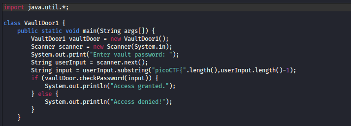
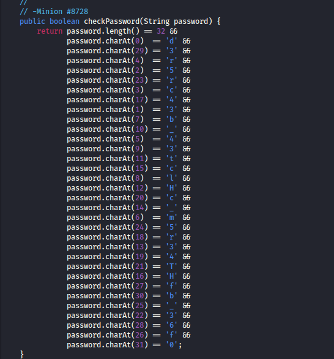
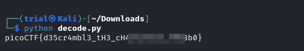

---
tags:
  - reverse-engineering
points: 100 points
---

[<-- Vault Door Series Playlist](../../writeup-list.md#vault-door-series)

# vault-door-1
## Write-up

##### Concept Coverage :
This challenge is an introduction to challenge series of reverse-engineering problems on PicoCTF  Playlist named `Vault Door Series` .

##### Following are the steps for the challenge: 
1. We are given a Java file with the challenge. At time of writing it is called `VaultDoor1.java` but this might change in future.

2. I downloaded the file and decided to take a look at the code. I started to take a look with the main function. As we can see in main it expects a input in `picoCTF{<flag>}` format and then takes the `flag` as an input to `checkPassword()` function and based on its return value it allows access.

    

3. Since the passing condition is dependent on the `checkPassword()` function. lets take a look at it. I found that it takes a string as input and compares if a certain character is present at a certain index using `charAt()` function. In order to get the main function to pass we need `checkPassword()` to return which means the string that we input should satisfy all the `charAt()` function

    

4. So from that we can reverse-engineer the string that might make every conditon true. so i created a string in a going from index 0-31 and formed the flag string. I wrapped it around `picoCTF{}` and we can submit the flag and completed the challenge

    ```python
    split_string = ['d','3','5','c','r','4','m','b','l','3','_','t','H','3','_','c','H','4','r','4','c','T','3','r','5','_','f','f','6','3','b','0'] ## this will change.

    actual_string = ''.join(split_string)

    print("picoCTF{"+actual_string+"}")
    ```

    