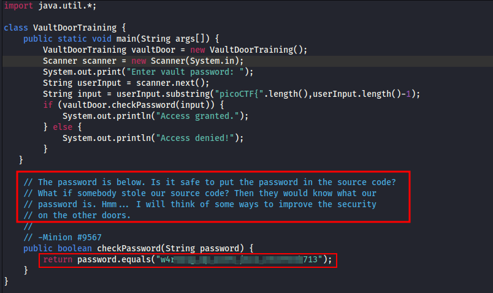

---
tags:
  - reverse-engineering
points: 50 points
---

[<-- Vault Door Series Playlist](./vault-door-series.md)

# Vault-Room-Training

## Write-up
##### Concept Coverage :
This challenge is an introduction to challenge series of reverse-engineering problems on PicoCTF  Playlist named `Vault Door Series` .

##### Following are the steps for the challenge: 
1. We are given a Java program file with the challenge.
2. Since this is a beginner challenge to the series this one is a straight-forward one. Upon opening the code file we find the password (flag) directly in the code.
    
    
    
3. Now we just need to wrap the flag with `picoCTF{}` and we can submit the flag.